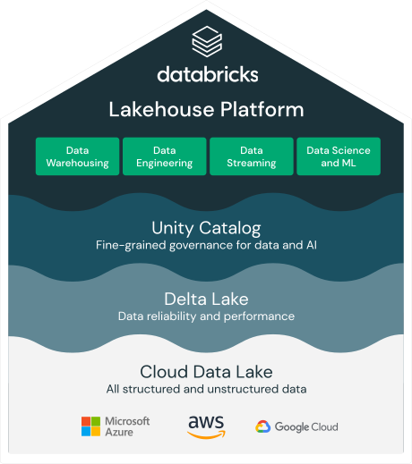

# Delta Lakehouse and Real Time Data Ingestion Platform

 {width=50%} 

Real Time Data Ingestion Platform leverages Delta and the concept of a Lakehouse to ingest, store and manage it's data. There are many benefits to Delta for performing data engineering tasks on files stored in a data lake including ACID transactions, maintenance, SQL query capability and performance at scale. To find out more about Delta Lakehouse please see [here.](https://databricks.com/product/data-lakehouse)

<!-- more -->

The Real Time Data Ingestion Platform team would like to share some lessons learnt from the implementation of Delta and the Lakehouse concept so that hopefully it helps others on their Delta Lakehouse journey.

For reference, please consider the typical layout of timeseries data ingested by RTDIP:

**Events**

| Column Name | Description |
|-------------|------------|
| TagName | Typically represents a sensor name or a measurement |
| EventTime | A timestamp for a recorded value |
| Status | Status of the recording, normally indicating if the measurement value is good or bad |
| Value | The value of the measurement and can be of a number of types - float, double, string, integer |

**Metadata**

| Column Name | Description |
|-------------|------------|
| TagName | Typically represents a sensor name or a measurement |
| Description | A description for the sensor |
| UoM | UoM for the measurement |

!!! note "Note"
    Metadata can include a number of additional columns and depends on the system that provides the metadata. The above are the required columns for any sensor data ingested by RTDIP.

## Design Considerations

Delta, in its simplest definition, is a set of parquet files managed by an index file. This allows Spark to perform tasks like partition pruning and file pruning to find the exact parquet file to be used by any ACID transactions being performed on it. By reducing the number of files and the amount of data that Spark needs to read in a query means that it will perform much better. It is important to consider the following when designing a Delta Table to achieve performance benefits:

- Columns that are likely to be used in most reads and writes
- Partition column(s)
- File Sizes

### Partition Columns

The biggest benefit achieved using Delta is to include a partition column in the design of a Delta Table. This is the fastest way for Spark to isolate the dataset it needs to work with in a query. The general rule of thumb is that each partition size should be roughly **1gb** in size, and ideally would be a column or columns that are used in every query to filter data for that table.

This can be difficult to achieve. The most queried columns in RTDIP event data are TagName and EventTime, however, partitioning data by TagName creates far too many small partitions and a timestamp column like EventTime can not be used for partitioning for the same reason. The best outcome is typically to create an additional column that is an aggregation of the EventTime column, such as a Date, Month or Year Column, depending on the frequency of the data being ingested. 

!!! note "Note"
    **Given the above, always query RTDIP delta events tables using EventDate in the filter to achieve the best results.**

One of the best methods to analyse Spark query performance is to analyse the query plan of a query. It is essential that a Spark query plan leverages a partition column. This can be identified by reviewing the query plan in Spark. As per the below query plan, it can be seen that for this particular query only one partition was read by Spark. Make sure to try different queries to identify that the expected number of partitions are being used by Spark in every query. If it does not match your expected number of partitions, it is important to investigate why partition pruning is not being leveraged in your query. 

  

### ZORDER Columns

Even though the rule is to achieve roughly **1gb** partitions for a Delta Table, Delta is likely to divide that partition into a number of files. The default target size is around 128gb per file. Due to this, it is possible to improve performance above and beyond partitioning by telling Spark which files within in a partition to read. This is where **ZORDER** becomes useful. 

Zordering organises the data within each file, and along with the Delta Index file, directs Spark to the exact files to use in its reads(and merge writes) on the table. It is important to find the right number of columns to ZORDER - the best outcome would be a combination of columns that does not cause the index to grow too large. For example, ZORDERING by TagName creates a small index, but ZORDERING by TagName and EventTime created a huge index as there are far more combinations to be indexed.

The most obvious column to ZORDER on in RTDIP is the TagName as every query is likely to use this in its filter. Like partition pruning, it is possible to identify the impact of ZORDERING on your queries by reviewing the files read attribute in the query plan. As per the query plan below, you can see that two files were read within the one partition.

  

### MERGE and File Sizes

As stated above, the default target size for file sizes within a partition is 128gb. However, this is not always ideal and in certain scenarios, it is possible to improve performance of Spark jobs by reducing file sizes in certain scenarios:
- MERGE commands
- Queries that target very small subsets of data within a file

Due to the nature of Merges, its typically an action where small updates are being made to the dataset. Due to this, it is possible to get much better MERGE performance by setting the following attribute on the Delta Table `delta.tuneFileSizesForRewrites=true`. This targets smaller file sizes to reduce the amount of data in each read a MERGE operation performs on the data. RTDIP gained a significant performance improvement in reading and writing and was able to reduce the Spark cluster size by half by implementing this setting on its Delta Tables.

However, even more performance gain was achieved when Databricks released [Low Shuffle Merge](https://databricks.com/blog/2021/09/08/announcing-public-preview-of-low-shuffle-merge.html) from DBR 9.0 onwards. This assists Spark to merge data into files without disrupting the ZORDER layout of Delta files, in turn assisting Merge commands to continue leveraging ZORDER performance benefits on an ongoing basis. RTDIP was able to improve MERGE performance by 5x with this change. To leverage Low Shuffle Merge, set the following Spark config in your notebook `spark.databricks.delta.merge.enableLowShuffle=true`.

### Delta Table Additional Attributes

It is recommended to consider setting the following two attributes on all Delta Tables:

- `delta.autoOptimize.autoCompact=true`
- `delta.autoOptimize.optimizeWrite=true`

To understand more about optimization options you can set on Delta Tables, please refer to this [link.](https://docs.databricks.com/delta/optimizations/file-mgmt.html)

## Maintenance Tasks

One important step to be included with every Delta Table is maintenance. Most developers forget these very important maintenance tasks that need to run on a regular basis to maintain performance and cost on Delta Tables.

As a standard, run a maintenance job every 24 hours to perform OPTIMIZE and VACUUM commands on Delta Tables.

### OPTIMIZE

OPTIMIZE is a Spark SQL command that can be run on any Delta Table and is the simplest way to optimize the file layout of a Delta Table. The biggest benefit of running OPTIMIZE however, is to organize Delta files using ZORDER. Due to how effective ZORDER is on queries, its unlikely that OPTIMIZE would not be executed on a Delta Table regularly.

It may be a question as to why one would run OPTIMIZE as well as set `delta.autoOptimize.autoCompact=true` on all its tables. Auto Compact does not ZORDER its data(at the time of writing this article), its task is simply to attempt to create larger files during writing and avoid the small file problem. Therefore, autoCompact does not provide ZORDER capability. Due to this, consider an OPTIMIZE strategy as follows:
- Auto Compact is used by default for any new files written to an RTDIP Delta Table between the execution of maintenance jobs. This ensures that any new data ingested by RTDIP is still being written in a suitable and performant manner.
- OPTIMIZE with ZORDER is run on a daily basis on any partitions that have changed(excluding the current day) to ensure ZORDER and updating of the Delta Index file is done. 

!!! note "Note"
    RTDIP data is going to typically be ingesting using Spark Streaming - given the nature of a real time data ingestion platform, it makes sense that data ingestion is performed in real time. One complication this introduces is the impact of the OPTIMIZE command being executed at the same time as files being written to a partition. Due to this, execute OPTIMIZE on partitions where the EventDate is not equal to the current date, minimizing the possibility of an OPTIMIZE command and a file write command being executed on a partition at the same time. This logic reduces issues experienced by both the maintenance job and Spark streaming job.

### VACUUM

One of the most powerful features of Delta is time travel. This allows querying of data as at a certain point of time in the past, or a particular version of the Delta Table. Whilst incredibly useful, it does consume storage space and if these historical files are never removed, the size of Delta Tables can grow exponentially large and increase cost.

To ensure only the required historical versions of a Delta Table are stored, its important to execute the VACUUM command every 24 hours. This deletes any files or versions that are outside the time travel retention period.

## Conclusion

Delta and the Lakehouse transformed the way RTDIP ingests its data and provides integration with other projects, applications and platforms. We hope the above assists others with their Delta development and we look forward to posting more content on RTDIP and its use of Spark in the future.