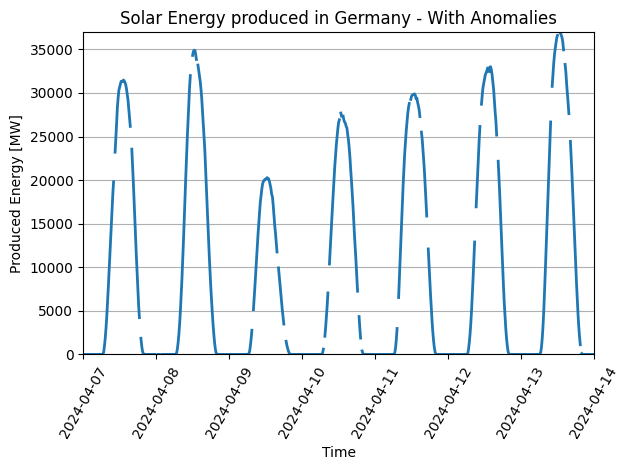
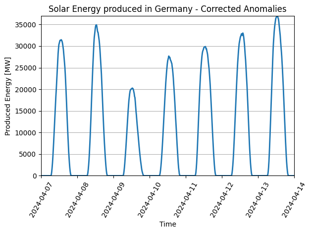

# Enhancing Data Quality in Real-Time: Our Experience with RTDIP and the AMOS Project

<center>

{width=60%}
<small>1</small>
</center>

Real-time data integration and preparation are crucial in today's data-driven world, especially when dealing with time series data from often distributed heterogeneous data sources. As data scientists often spend no less than 80%<sup>2</sup> of their time finding, integrating, and cleaning datasets, the importance of automated ingestion pipelines rises inevitably. Building such ingestion and integration frameworks can be challenging and can entail all sorts of technical debt like glue code, pipeline jungles, or dead code paths, which calls for precise conception and development of such systems. Modern software development approaches try to mitigate technical debts and enhance quality results by introducing and utilizing agile and more iterative methodologies, which are designed to foster rapid feedback and continuous progress.

<!-- more -->

As part of the Agile Methods and Open Source (AMOS) project, we had the unique opportunity to work in a SCRUM team consisting of students from TU Berlin and FAU Erlangen-Nürnberg, to build data quality measures for the RTDIP Ingestion Pipeline framework. With the goal of enhancing data quality, we got to work and built modular pipeline components that aim to help data scientists and engineers with data integration, data cleaning, and data preparation.

But what does it mean to work in an agile framework? The Agile Manifesto is above all a set of guiding values, principles, ideals, and goals. The overarching goal is to gain performance and be most effective while adding business value. By prioritizing the right fundamentals like individuals and interactions, working software, customer collaboration, and responding to change, cross-functional teams can ship viable products easier and faster.

How that worked out for us in building data quality measures? True to the motto "User stories drive everything," we got together with contributors from the RTDIP Team to hear about concepts, the end users' stake in the project, and the current state to get a grasp on the expectations we can set on ourselves. With that, we got to work and planned our first sprint, and soon, we got the idea of how agile implementation is here to point out deficiencies in our processes. Through regular team meetings, we fostered a culture of continuous feedback and testing, leveraging reviews and retrospectives to identify roadblocks and drive necessary changes that enhance the overall development process.

## Enhancing Data Quality in RTDIP's Pipeline Framework

Coming up with modular steps that enhance data quality was the initial and arguably most critical step to start off a successful development process. So the question was: what exactly do the terms data integration, data cleaning, and data preparation entail? To expand on the key parts of that, this is what we did to pour these aspects into RTDIP components.

### Data Validation and Schema Alignment

Data validation and schema alignment are critical for ensuring the reliability and usability of data, serving as a foundational step before implementing other quality measures. For the time series data at hand, we developed an InputValidator component to verify that incoming data adheres to predefined quality standards, including compliance with an expected schema, correct PySpark data types, and proper handling of null values, raising exceptions when inconsistencies are detected. Additionally, the component enforces schema integration, harmonizing data from multiple sources into a unified, predefined structure. To maintain a consistent and efficient workflow, we required all data quality components to inherit the validation functionality of the InputValidator.

### Data Cleansing

Data cleansing is a vital process in enhancing the quality of data within a data integration pipeline, ensuring consistency, reliability, and usability. We implemented functionalities such as duplicate detection, which identifies and removes redundant records to prevent skewed analysis, and flatline filters, which eliminate constant, non-informative data points. Interval and range filters are employed to validate the time series data against predefined temporal or value ranges, ensuring conformity with expected patterns. Additionally, a K-sigma anomaly detection component identifies outliers based on statistical deviations, enabling the isolation of erroneous or anomalous values. Together, these methods ensure the pipeline delivers high-quality, actionable data for downstream processes.

### Missing Value Imputation

With a dataset refined to exclude unwanted data points and accounting for potential sensor failures, the next step toward ensuring high-quality data is to address any missing values through imputation. The component we developed first identifies and flags missing values by leveraging PySpark’s capabilities in windowing and UDF operations. With these techniques, we are able to dynamically determine the expected interval for each sensor by analyzing historical data patterns within defined partitions. Spline interpolation allows us to estimate missing values in time series data, seamlessly filling gaps with plausible and mathematically derived substitutes. By doing so, data scientists can not only improve the consistency of integrated datasets but also prevent errors or biases in analytics and machine learning models.
To actually show how this is realized with this new RTDIP component, let me show you a short example on how a few lines of code can enhance an exemplary time series load profile:
```python
from rtdip_sdk.pipelines.data_quality import MissingValueImputation
from pyspark.sql import SparkSession
import pandas as pd

spark_session = SparkSession.builder.master("local[2]").appName("test").getOrCreate()

source_df = pd.read_csv('./solar_energy_production_germany_April02.csv')
incomplete_spark_df = spark_session.createDataFrame(vi_april_df, ['Value', 'EventTime', 'TagName', 'Status'])

#Before Missing Value Imputation
spark_df.show()

#Execute RTDIP Pipeline component
clean_df = MissingValueImputation(spark_session, df=incomplete_spark_df).filter_data()

#After Missing Value Imputation
clean_df.show()
```
To illustrate this visually, plotting the before-and-after DataFrames reveals that all gaps have been successfully filled with meaningful data.

<center>

{width=70%}

{width=70%}

</center>


### Normalization

Normalization is a critical step in ensuring data quality within data integration pipelines with various sources. Techniques like mean normalization, min-max scaling, and z-score standardization help transform raw time series data into a consistent scale, eliminating biases caused by differing units or magnitudes across features. It enables fair comparisons between variables, accelerates algorithm convergence, and ensures that data from diverse sources aligns seamlessly, supporting possible downstream processes such as entity resolution, data augmentation, and machine learning. To offer a variety of use cases within the RTDIP pipeline, we implemented normalization techniques like mean normalization, min-max scaling, and z-score standardization as well as their respective denormalization methods.

### Data Monitoring

Data monitoring is another aspect of enhancing data quality within the RTDIP pipeline, ensuring the reliability and consistency of incoming data streams. Techniques such as flatline detection identify periods of unchanging values, which may indicate sensor malfunctions or stale data. Missing data identification leverages predefined intervals or historical patterns to detect and flag gaps, enabling proactive resolution. By continuously monitoring for these anomalies, the pipeline maintains high data integrity, supporting accurate analysis for inconsistencies.

### Data Prediction

Forecasting based on historical data patterns is essential for making informed decisions on a business level. Linear Regression is a simple yet powerful approach for predicting continuous outcomes by establishing a relationship between input features and the target variable. However, for time series data, the ARIMA (Autoregressive Integrated Moving Average) model is often preferred due to its ability to model temporal dependencies and trends in the data. The ARIMA model combines autoregressive (AR) and moving average (MA) components, along with differencing to stabilize the variance and trends in the time series. ARIMA with autonomous parameter selection takes this a step further by automatically optimizing the model’s parameters (p, d, q) using techniques like grid search or other statistical criteria, ensuring that the model is well-suited to the data’s underlying structure for more accurate predictions. To address this, we incorporated both an ARIMA component and an AUTO-ARIMA component, enabling the prediction of future time series data points for each sensor.

<br>

Working on the RTDIP Project within AMOS has been a fantastic journey, highlighting the importance of people and teamwork in agile development. By focusing on enhancing data quality, we’ve significantly boosted the reliability, consistency, and usability of the data going through the RTDIP pipeline.

To look back, our regular team meetings were the key to our success. Through open communication and collaboration, we tackled challenges and kept improving our processes. This showed us the power of working together in an agile framework and growing as a dedicated SCRUM team.

We’re excited about the future and how these advancements will help data scientists and engineers make better decisions.

<br>

<small>1 Designed by Freepik</small><br>
<small>2 Michael Stonebraker, Ihab F. Ilyas: Data Integration: The Current Status and the Way Forward. IEEE Data Eng. Bull. 41(2) (2018)</small>