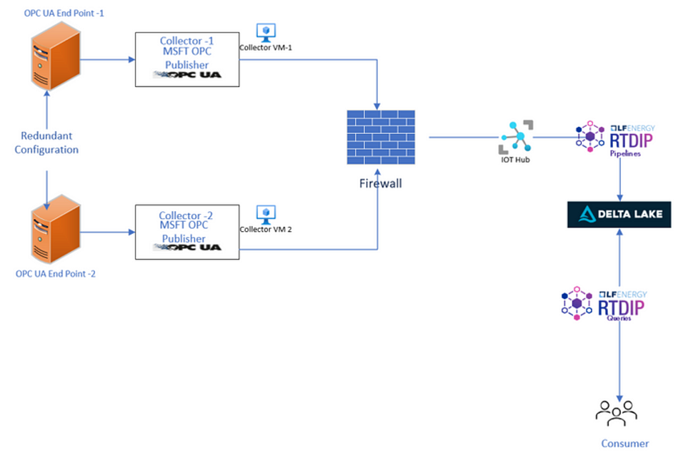

# Beyond the Traditional Data Historian

The Fourth Industrial Revolution, commonly known as IR4.0, has ushered in profound transformations in the landscape of industrial operations and manufacturing. Digital technologies and data derived from sensors are driving a wide array of innovations, spanning from advanced analytics and machine learning to the realms of augmented and virtual reality models.

Handling sensor-based data poses a unique challenge for conventional relational databases, which is why data historians were originally conceived in the latter part of the 1980s. They were specifically designed for integration with industrial automation systems like SCADA (supervisory control and data acquisition). Initially, their primary application was within the process manufacturing sector, encompassing industries such as oil and gas, chemicals, pharmaceuticals, pipelines, and refining.

This Historian system was developed as an ecosystem that provided a comprehensive solution, ranging from data interface software to data storage and data visualization. The industry 4.0 revolution has spurred automation in manufacturing, leveraging smart sensors and IoT devices to capture real-time data from the field. Furthermore, it has seen the increased utilization of Artificial Intelligence and Machine Learning for predictive analytics and decision support, both of which are data-hungry applications. So, with IR4.0 development what are the options available to cater requirements for real time data ingestion.

<!-- more -->

## What Are the Alternatives?

Hyperscalers have become a central part of global IT infrastructure and essential to operations and they also started providing industrial connectivity options out of many in this article I am going to focus on Azure , OPC UA & Open source stack which provides you all the options of data ingestion from OPC UA source to your cloud database.

{width=100%}

## Components

## Microsoft OPC Publisher as Interface

OPC Publisher is a Microsoft-endorsed solution that acts as a vital link between industrial equipment and the Azure cloud infrastructure. Its core function involves linking OPC UA-enabled devices or industrial connectivity software to your Azure cloud environment, transmitting collected telemetry data to Azure IoT Hub in multiple formats, one of which is the standardized IEC62541 OPC UA PubSub format (from version 2.6 onwards). 

OPC Publisher is versatile in its deployment options, running either as an Azure IoT Edge Module or a Docker container on various platforms, thanks to its compatibility with the .NET cross-platform runtime. Notably, it can seamlessly operate on both Linux and Windows 10 systems.

Refer to [Microsoft OPC Publisher documentation](https://learn.microsoft.com/en-us/azure/industrial-iot/tutorial-publisher-deploy-opc-publisher-standalone) for more information.

## RTDIP for Data Engineering

The Real-Time Data Ingestion Platform (RTDIP) is designed to offer convenient access to large volumes of historical and live operational data for analytical purposes, serving engineers and data scientists no matter where they are located.

### Key Components of RTDIP:

#### Delta Ingestion Engine:
This component operates in the cloud and is responsible for processing time series data sourced from various streaming endpoints such as Eventhub, Kafka, and others, as well as data from files. It ingests and organizes this data into a Delta Lakehouse.

To simplify the data ingestion from IoT hub, RTDIP has built Transformer components to convert the payload's defaultmessage encoding to json. The architecture above is using the transformer  [OPCPublisherOPCUAJsonToPCDMTransformer](https://www.rtdip.io/sdk/pipelines/components/#:~:text=OPC%20Publisher%20OPCUA%20Json%20To%20Process%20Control%20Data%20Model) to handle that scenario.

#### Query Engine
Python SDK: The Python Software Development Kit (SDK) empowers users to interact with the data stored within the Delta Lakehouse. It provides a programmatic interface for working with the data.

#### REST APIs
In addition to the Python SDK, RTDIP offers RESTful Application Programming Interfaces (APIs) that deliver the same capabilities as the Python SDK. These APIs enable users to interact 
and manipulate the data stored in the Delta Lakehouse through HTTP requests, making it accessible for a wide range of applications and services.

See [Real Time Data Ingestion Platform](https://www.rtdip.io/) for more information.

## Visualization

Real-time data visualization is a dynamic and essential component of data analytics and monitoring processes. It involves the presentation of data as it is generated or updated in real-time, allowing users to gain instant insights and make informed decisions. But for visualization there is always different requirement, in current open source scenario we have different options available which can be used as required:

- [Plotly](https://plotly.com/)
- [Dash](https://plotly.com/dash/)
- [Grafana](https://grafana.com/docs/grafana/latest/)

## Conclusion

To conclude this article, it is important to emphasize the wide array of open-source options at the disposal of historians. In today’s market, numerous open-source components can be harnessed to create bespoke solutions that seamlessly link with your process control systems, enabling the integration of real-time data into modern data platforms. While this article focused on Azure as an illustration, it’s worth noting that AWS offers similar capabilities, providing flexibility and adaptability to cater to your specific needs.