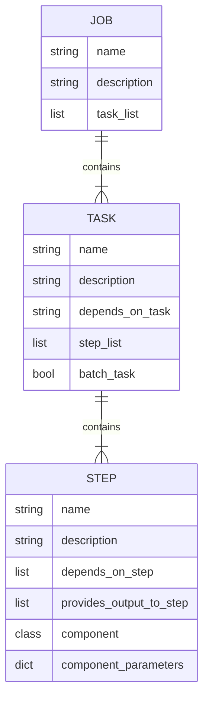
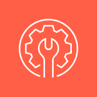
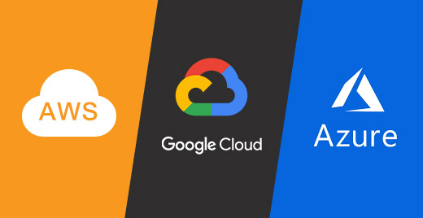

# RTDIP Ingestion Pipeline Framework

{width=60%}

RTDIP has been built to simplify ingesting and querying time series data. One of the most anticipated features of the Real Time Data Ingestion Platform for 2023 is the ability to create streaming and batch ingestion pipelines according to requirements of the source of the data and needs of the data consumer. Of equal importance is the need to query this data and an article that focuses on egress will follow in due course. 

<!-- more -->

## Overview

The goal of the RTDIP Ingestion Pipeline framework is:

1. Support python and pyspark to build pipeline components
1. Enable execution of sources, transformers, sinks/destinations and utilities components in a framework that can execute them in a defined order
1. Create modular components that can be leveraged as a step in a pipeline task using Object Oriented Programming techniques included Interfaces and Implementations per component type
1. Deploy pipelines to popular orchestration engines
1. Ensure pipelines can be constructed and executed using the RTDIP SDK and rest APIs

## Pipeline Jobs

The RTDIP Data Ingestion Pipeline Framework will follow the typical convention of a job that users will be familiar with if they have used orchestration engines such as Apache Airflow or Databricks Workflows.

A pipeline job consists of the following components:

As per the above, a pipeline job consists of a list of tasks. Each task consists of a list of steps. Each step consists of a component and a set of parameters that are passed to the component. Dependency Injection will ensure that each component is instantiated with the correct parameters.

## Pipeline Runtime Environments

|Python|Apache Spark|Databricks|Delta Live Tables|
|---------------------------|----------------------|--------------------------------------------------|-------|
|{: .image-center}|{: .image-center}|{: .image-center}|{: .image-center}

Pipelines will be able to run in multiple environment types. These will include:

- Python: Components will be written in python and executed on a python runtime
- Pyspark: Components will be written in pyspark and executed on an open source Apache Spark runtime
- Databricks: Components will be written in pyspark and executed on a Databricks runtime
- Delta Live Tables: Components will be written in pyspark and executed on a Databricks runtime and will write to Delta Live Tables

Runtimes will take precedence depending on the list of components in a pipeline task.

- Pipelines with at least one Databricks or DLT component will be executed in a Databricks environment
- Pipelines with at least one Pyspark component will be executed in a Pyspark environment
- Pipelines with only Python components will be executed in a Python environment

## Pipeline Clouds

{: .image-center}

Certain components are related to cloud providers and in the tables below, it is indicated which cloud provider is related to its specific component. It does not mean that the component can only run in that cloud, instead its highlighting that the component is related to that cloud provider.

|Cloud|Target|
|--------------------|------|
| Azure|Q1-Q2 2023|
| AWS|Q2-Q4 2023|
| GCP|2024|

## Pipeline Orchestration

|Airflow|Databricks|Dagster|
|---------------------------|----------------------|--------------------------------------------------|
||||

Pipelines will be able to be deployed to orchestration engines so that users can schedule and execute jobs using their preferred orchestration engine.

|Orchestration Engine|Target|
|--------------------|------|
| Databricks Workflows|Q2 2023|
| Airflow|Q2 2023|
| Delta Live Tables|Q3 2023|
| Dagster|Q4 2023|

## Pipeline Components

The Real Time Data Ingestion Pipeline Framework will support the following components:

- Sources - connectors to source systems
- Transformers - perform transformations on data, including data cleansing, data enrichment, data aggregation, data masking, data encryption, data decryption, data validation, data conversion, data normalization, data de-normalization, data partitioning etc
- Destinations - connectors to sink/destination systems 
- Utilities - components that perform utility functions such as logging, error handling, data object creation, authentication, maintenance etc
- Edge - components that will perform edge functionality such as connectors to protocols like OPC

### Pipeline Component Types

|Python|Apache Spark|Databricks|
|---------------------------|----------------------|--------------------------------------------------|
||||

Component Types determine system requirements to execute the component:

- Python - components that are written in python and can be executed on a python runtime
- Pyspark - components that are written in pyspark can be executed on an open source Apache Spark runtime
- Databricks - components that require a Databricks runtime

### Sources

Sources are components that connect to source systems and extract data from them. These will typically be real time data sources, but will also support batch components as these are still important and necessary data souces in a number of circumstances in the real world.

|Source Type|Python|Apache Spark|Databricks|Azure|AWS|Target|
|---------------------------|----------------------|--------------------|----------------------|----------------------|---------|---------|
| Delta|*:heavy_check_mark:|:heavy_check_mark:|:heavy_check_mark:|:heavy_check_mark:|:heavy_check_mark:|Q1 2023|
| Delta Sharing|*:heavy_check_mark:|:heavy_check_mark:|:heavy_check_mark:|:heavy_check_mark:|:heavy_check_mark:|Q1 2023|
| Autoloader|||:heavy_check_mark:|:heavy_check_mark:|:heavy_check_mark:|Q1 2023|
| Eventhub|*:heavy_check_mark:|:heavy_check_mark:|:heavy_check_mark:|:heavy_check_mark:||Q1 2023|
| IoT Hub|*:heavy_check_mark:|:heavy_check_mark:|:heavy_check_mark:|:heavy_check_mark:||Q2 2023|
| Kafka|:heavy_check_mark:|:heavy_check_mark:|:heavy_check_mark:|:heavy_check_mark:|:heavy_check_mark:|Q2 2023|
| Kinesis||:heavy_check_mark:|:heavy_check_mark:||:heavy_check_mark:|Q2 2023|
| SSIP PI Connector||:heavy_check_mark:|:heavy_check_mark:|:heavy_check_mark:|:heavy_check_mark:|Q2 2023|
| Rest API|:heavy_check_mark:|:heavy_check_mark:|:heavy_check_mark:|:heavy_check_mark:|:heavy_check_mark:|Q2 2023|
| MongoDB|:heavy_check_mark:|:heavy_check_mark:|:heavy_check_mark:|:heavy_check_mark:|:heavy_check_mark:|Q3 2023|

*:heavy_check_mark: - target to deliver in the following quarter

There is currently no spark connector for IoT Core. If you know a way to add it as a source component, please raise it by creating an [issue](https://github.com/rtdip/core/blob/develop/CONTRIBUTING.md#issues-guidelines){ target="_blank" } on the GitHub repo.

### Transformers

Transformers are components that perform transformations on data. These will target certain data models and common transformations that sources or destination components require to be performed on data before it can be ingested or consumed.

|Transformer Type|Python|Apache Spark|Databricks|Azure|AWS|Target|
|---------------------------|----------------------|--------------------|----------------------|----------------------|---------|---------|
| Eventhub Body||:heavy_check_mark:|:heavy_check_mark:|:heavy_check_mark:||Q1 2023|
| OPC UA|:heavy_check_mark:|:heavy_check_mark:|:heavy_check_mark:|:heavy_check_mark:|:heavy_check_mark:|Q2 2023|
| OPC AE|:heavy_check_mark:|:heavy_check_mark:|:heavy_check_mark:|:heavy_check_mark:|:heavy_check_mark:|Q2 2023|
| SSIP PI |:heavy_check_mark:|:heavy_check_mark:|:heavy_check_mark:|:heavy_check_mark:|:heavy_check_mark:|Q2 2023|
| OPC DA|:heavy_check_mark:|:heavy_check_mark:|:heavy_check_mark:|:heavy_check_mark:|:heavy_check_mark:|Q3 2023|

*:heavy_check_mark: - target to deliver in the following quarter

This list will dynamically change as the framework is developed and new components are added.

### Destinations

Destinations are components that connect to sink/destination systems and write data to them. 

|Destination Type|Python|Apache Spark|Databricks|Azure|AWS|Target|
|---------------------------|----------------------|--------------------|----------------------|----------------------|---------|---------|
| Delta Append|*:heavy_check_mark:|:heavy_check_mark:|:heavy_check_mark:|:heavy_check_mark:|:heavy_check_mark:|Q1 2023|
| Eventhub|*:heavy_check_mark:|:heavy_check_mark:|:heavy_check_mark:|:heavy_check_mark:||Q1 2023|
| Delta Merge||:heavy_check_mark:|:heavy_check_mark:|:heavy_check_mark:|:heavy_check_mark:|Q2 2023|
| Kafka|:heavy_check_mark:|:heavy_check_mark:|:heavy_check_mark:|:heavy_check_mark:|:heavy_check_mark:|Q2 2023|
| Kinesis||:heavy_check_mark:|:heavy_check_mark:||:heavy_check_mark:|Q2 2023|
| Rest API|:heavy_check_mark:|:heavy_check_mark:|:heavy_check_mark:|:heavy_check_mark:|:heavy_check_mark:|Q2 2023|
|MongoDB|:heavy_check_mark:|:heavy_check_mark:|:heavy_check_mark:|:heavy_check_mark:|:heavy_check_mark:|Q3 2023|
| Polygon Blockchain|:heavy_check_mark:|||:heavy_check_mark:|:heavy_check_mark:|Q3 2023|

*:heavy_check_mark: - target to deliver in the following quarter

### Utilities

Utilities are components that perform utility functions such as logging, error handling, data object creation, maintenance and are normally components that can be executed as part of a pipeline or standalone.

|Utility Type|Python|Apache Spark|Databricks|Azure|AWS|Target|
|---------------------------|----------------------|--------------------|----------------------|----------------------|---------|---------|
| Delta Table Create|*:heavy_check_mark:|:heavy_check_mark:|:heavy_check_mark:|:heavy_check_mark:|:heavy_check_mark:|Q1 2023|
| Delta Optimize||:heavy_check_mark:|:heavy_check_mark:|:heavy_check_mark:|:heavy_check_mark:|Q2 2023|
| Delta Vacuum|*:heavy_check_mark:|:heavy_check_mark:|:heavy_check_mark:|:heavy_check_mark:|:heavy_check_mark:|Q2 2023|
| Set ADLS Gen2 ACLs|:heavy_check_mark:|||:heavy_check_mark:||Q2 2023|
| Set S3 ACLs|:heavy_check_mark:||||:heavy_check_mark:|Q2 2023|
| Great Expectations|:heavy_check_mark:|:heavy_check_mark:|:heavy_check_mark:|:heavy_check_mark:|:heavy_check_mark:|Q3 2023|

*:heavy_check_mark: - target to deliver in the following quarter

### Secrets

Secrets are components that perform authentication functions and are normally components that can be executed as part of a pipeline or standalone.

|Secrets Type|Python|Apache Spark|Databricks|Azure|AWS|Target|
|---------------------------|----------------------|--------------------|----------------------|----------------------|---------|---------|
| Databricks Secrets|||:heavy_check_mark:|:heavy_check_mark:|:heavy_check_mark:|Q2 2023|
| Hashicorp Vault|:heavy_check_mark:|:heavy_check_mark:|:heavy_check_mark:|:heavy_check_mark:|:heavy_check_mark:|Q2 2023|
| Azure Key Vault|:heavy_check_mark:|:heavy_check_mark:|:heavy_check_mark:|:heavy_check_mark:|:heavy_check_mark:|Q3 2023|
| AWS Secrets Manager|:heavy_check_mark:|:heavy_check_mark:|:heavy_check_mark:|:heavy_check_mark:|:heavy_check_mark:|Q3 2023|

### Edge

Edge components are designed to provide a lightweight, low latency, low resource consumption, data ingestion framework for edge devices. These components will be designed to run on edge devices such as Raspberry Pi, Jetson Nano, etc. For cloud providers, this will be designed to run on AWS Greengrass and Azure IoT Edge.

|Edge Type|Azure IoT Edge|AWS Greengrass|Target|
|---------|--------------|--------------|------|
| OPC CloudPublisher|:heavy_check_mark:||Q3-Q4 2023|
| Fledge |:heavy_check_mark:|:heavy_check_mark:|Q3-Q4 2023|
| Edge X |:heavy_check_mark:|:heavy_check_mark:|Q3-Q4 2023|

## Conclusion

This is a very high level overview of the framework and the components that will be developed. As the framework is open source, the lists defined above and timelines can change depending on circumstances and resource availability. Its an exciting year for 2023 for the Real Time Data Ingestion Platform. Check back in regularly for updates and new features! If you would like to contribute, please visit our repository on Github and connect with us on our Slack channel on the LF Energy Foundation Slack workspace.