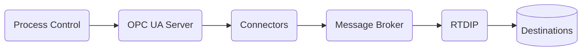
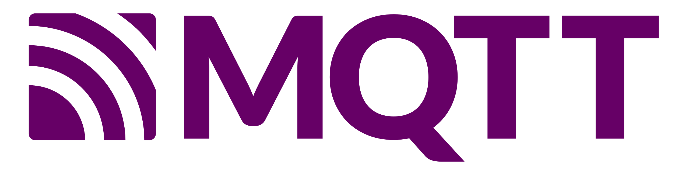

# Process Control Domain Overview

For process control systems, RTDIP provides the ability to consume data from these sources, transform it and store the data in an open source format to enable:

- Data Science, ML and AI applications to consume the data
- Real time data in Digital Twins
- BI and Analytics 
- Reporting

## Process Control Systems

Process control systems monitor, control and safeguard production operations and generate vast amounts of data. Typical industry use cases include:

- Electricity Generation, Transmission and Distribution
- Chemicals, Gas, Oil Production and Distribution
- LNG Processing and Product Refining 

Process control systems record variables such as temperature, pressure, flow etc and automatically make adjustments to maintain preset specifications in a technical process.

This data can be made available to other systems over a number of protocols, such as [OPC UA.](https://opcfoundation.org/about/opc-technologies/opc-ua/) The protocols in turn make the data available to connectors that can send the data onwards to other systems and the cloud.

## Architecture

### Connectors

A number of connectors are available from various suppliers. Some open source options include:

[{width=40%}](https://www.lfedge.org/projects/fledge/) 

 [{width=50%}](https://www.lfedge.org/projects/edgexfoundry/) 

### Message Brokers

Message Brokers support publishing of data from connectors and subscribing(pub/sub) to data from consumers. Popular options used with RTDIP are:

[{width=40%}](https://kafka.apache.org/) 

[{width=40%}](https://mqtt.org/) 

[{width=40%}](https://azure.microsoft.com/en-us/products/iot-hub) 

## Real Time Data Ingestion Platform

For more information about the Real Time Data Platform and its components to connect to data sources and destinations, please refer to this [link.](../../sdk/overview.md)

