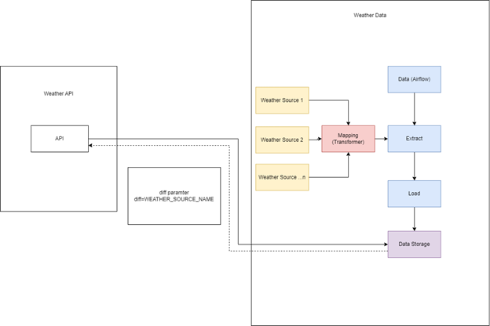
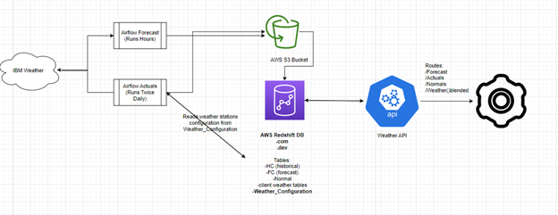
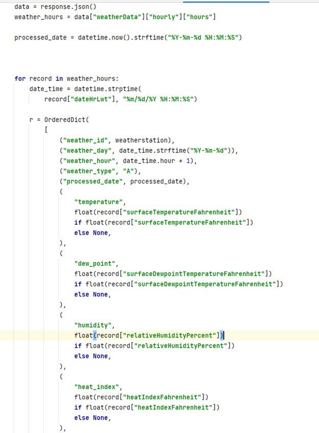
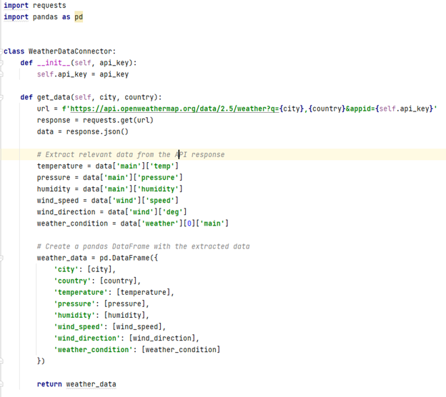
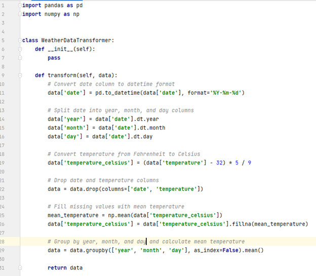

# RTDIP - Weather Data 

# LF Energy - RTDIP

{width=100%}

Organizations need data for day-to-day operations and to support advanced Data Science, Statistical and Machine Learning capabilities such as Optimization, Surveillance, Forecasting, and Predictive Analytics. Real Time Data & batch data forms a major part of the total data utilized in these activities.

Data enables organizations to detect and respond to changes in their systems thus improving the efficiency of their operations. Additionally, batch and mini-batch data form the crux of many organisational offerings. This range of data needs to be available in scalable and secure data platforms.

**Real Time Data Ingestion Platform (RTDIP)** is a **PaaS** (Platform as a Service) which coupled with some custom components provides Data Ingestion, Data Transformation, and Data Sharing as a service. RTDIP can interface with several data sources to ingest many different data types which include time series, alarms, video, photos and audio being provided from sources such as Historians, OPC Servers and Rest APIs, as well as data being sent from hardware such as IoT Sensors, Robots and Drones

# Introduction

A primary aim for RTDIP in 2023 is to demonstrate how the platform can be utilized for domain specific services such as load forecasting in the Energy Domain. Load forecasting is a technique used by power or energy-providing companies to predict the power/energy needed to meet the demand and supply equilibrium.

Weather data is a primary driver of variance in load forecasting. RTDIP aims to ingest, transform, store and provide access to such generic data which can then be utilised in a domain specific context.

This document will summarize the most popular Weather Data formats, its usage in IW & Shell Services & expand to describe how weather data can be supported within RTDIP. 

# Weather Data

## Weather Data Standards

Weather data standards refer to a set of guidelines and protocols for collecting, processing, and disseminating weather data. These standards are important for ensuring that weather data is accurate, consistent, and can be easily shared and analyzed by different organizations and systems.

One of the most widely used weather data standards is the METAR (Meteorological Aerodrome Report) and ICAO (International Civil Aviation Organization) standard. This standard is used by meteorological agencies and aviation organizations around the world to report weather conditions at airports and other aviation facilities. 

The METAR ICAO standard includes a set of codes and abbreviations that describe weather conditions in a standardized format. These codes include information such as temperature, wind speed and direction, visibility, cloud cover, and precipitation. The standard also includes codes for reporting special weather phenomena, such as thunderstorms or volcanic ash.

The METAR ICAO standard is designed to be easily understood and used by pilots, air traffic controllers, and meteorologists. It provides a common language for reporting weather conditions, allowing aviation organizations to make informed decisions about flight operations and safety.

In addition to the METAR ICAO standard, there are other weather data standards used for different purposes. For example, the WMO (World Meteorological Organization) has developed standards for exchanging weather data between national meteorological agencies, while the NOAA (National Oceanic and Atmospheric Administration) has developed standards for collecting and processing weather data in the United States.

Innowatts is using Historical METAR data, containing a set of selected standard weather variables (temperature, cloud cover, humidity etc).  Aggregated METAR weather information is used in IW Models. This data comes from permanent weather observation stations on a typical report cadence of 15min to 1hr.

## Innowatts Weather Data Formats

Historical Data is used to calculate Normals which is an average of 21 years and TMY (Typical Meteorological Year).

Forecast data is using TAF format, which is similar to METAR but contains extra forecast variables from IBM GRAF (IBM Global High-Resolution Atmospheric Forecasting System) 

System Diagram [Diagram 1] describes a high level architecture design of Weather Data ingestion considering multiple weather data sources based on METAR ICAO type. All sources (Historical, Forecast and CoD) share similar schemas. More details will be provided later in this document. 

{width=100%}

[Diagram 1] High level Weather Data Ingestion 

# Innowatts

**Innowatts Competitive Edge **- is a SaaS offering providing data analytic services to the Energy domain, primarily the electrical domain. The platform offers services with respect to, but not limited to:

* Load forecasting
* Load scheduling
* Risk Mgmt
* Profitability
* Wholesale settlements

**Innowatts Weather Data** - Load forecasting i.e. predicting the consumption patterns of electrical users going forward is the primary service within Innowatts. Load forecasting is essential for the electrical domain to meet the demand and supply equilibrium**.**

The Innowatts weather service ingests METAR data, stores it in S3 & loads it into AWS Redshift  where it is queryable via an API service.[Diagram 2]

This ingestion process is orchestrated by Airflow and DAG’s are scheduled according to source Data availability

* Historical Actuals: DAG runs twice a day
* 15-day Enhanced Forecast: DAG runs hourly
* Currents On Demand (CoD): DAG runs every 15min

The data is available for hundreds to thousands of METAR stations across the globe

## IW Weather Data Types

**CoD:** CoD is an external system that, at request time, assimilates a variety of meteorological inputs to derive a current condition value precise to the requested location on the Earth's surface. The meteorological inputs include physical surface observations, radar, satellite, lightning and short-term forecast models.  The CoD system spatially and temporally blends each input appropriately at request-time, producing a result that improves upon any individual input used on its own.  

The CoD data feed returns a similar set of data elements as traditional site-based observations. The API provides information on temperature, precipitation, wind, barometric pressure, visibility

**15-Day Enhanced Forecast:** The Hourly Forecast returns weather forecasts starting with the current day at a 4 km resolution and includes relevant temperature, wind and precipitation features. 

**Cleaned Historical Actuals:** Provides a variety of observed and derived historical meteorological parameters including temperature, dewpoint, air pressure, wind speed and direction, relative humidity, degree day variables, as well as a set of specialized variables including soil moisture, sea level pressure, wind gust, cloud cover and others. Variables are available by latitude/longitude or specific location code.

{width=100%}

[Diagram 2] Innowatts Weather Service

<table>
  <tr>
   <td><strong>Name</strong>
   </td>
   <td><strong>Description</strong>
   </td>
  </tr>
  <tr>
   <td><strong>dateHrGmt</strong>
   </td>
   <td>Greenwich Mean Time (GMT) date-time (also known as Universal Time)
   </td>
  </tr>
  <tr>
   <td><strong>dateHrLwt</strong>
   </td>
   <td>Valid local date-time (Local wall time {includes daylight savings time})
   </td>
  </tr>
  <tr>
   <td><strong>surfaceTemperatureFahrenheit</strong>
   </td>
   <td>Surface air (dry bulb) temperature at 2 meters
   </td>
  </tr>
  <tr>
   <td><strong>surfaceDewpointTemperatureFahrenheit</strong>
   </td>
   <td>Atmospheric humidity metric (temperature at which dew will form)
   </td>
  </tr>
  <tr>
   <td><strong>surfaceWetBulbTemperatureFahrenheit</strong>
   </td>
   <td>Atmospheric humidity metric (evaporative cooling potential of moist surface)
   </td>
  </tr>
  <tr>
   <td><strong>relativeHumidityPercent</strong>
   </td>
   <td>Percent of water vapor in the air relative to its saturation point
   </td>
  </tr>
  <tr>
   <td><strong>apparentTemperatureFahrenheit</strong>
   </td>
   <td>Air temperature that includes impact of wind and humidity
   </td>
  </tr>
  <tr>
   <td><strong>windChillTemperatureFahrenheit</strong>
   </td>
   <td>Air temperature that includes impact of wind
   </td>
  </tr>
  <tr>
   <td><strong>heatIndexFahrenheit</strong>
   </td>
   <td>Air temperature that includes the impact of humidity
   </td>
  </tr>
  <tr>
   <td><strong>precipitationPreviousHourInches</strong>
   </td>
   <td>Liquid equivalent for types: warm rain, freezing rain, sleet, snow
   </td>
  </tr>
  <tr>
   <td><strong>snowfallInches</strong>
   </td>
   <td>Total Snowfall
   </td>
  </tr>
  <tr>
   <td><strong>surfaceAirPressureMillibars</strong>
   </td>
   <td>Atmospheric pressure at the Surface
   </td>
  </tr>
  <tr>
   <td><strong>mslPressureMillibars</strong>
   </td>
   <td>Mean Sea Level Pressure
   </td>
  </tr>
  <tr>
   <td><strong>cloudCoveragePercent</strong>
   </td>
   <td>Percentage of the sky covered by clouds
   </td>
  </tr>
  <tr>
   <td><strong>windSpeedMph</strong>
   </td>
   <td>Unobstructed wind speed at 10 meters
   </td>
  </tr>
  <tr>
   <td><strong>windDirectionDegrees</strong>
   </td>
   <td>Upwind direction (e.g., wind from east = 90, from south = 180, etc.) at 10 meters
   </td>
  </tr>
  <tr>
   <td><strong>surfaceWindGustsMph</strong>
   </td>
   <td>Unobstructed wind gusts at 10 meters
   </td>
  </tr>
  <tr>
   <td><strong>diffuseHorizontalRadiationWsqm</strong>
   </td>
   <td>Diffuse (indirect) solar radiation flux on a plane parallel to the Earth's surface
   </td>
  </tr>
  <tr>
   <td><strong>directNormalIrradianceWsqm</strong>
   </td>
   <td>Direct solar radiation flux on a surface 90 deg to the sun
   </td>
  </tr>
  <tr>
   <td><strong>downwardSolarRadiationWsqm</strong>
   </td>
   <td>Total solar radiation flux on a plane parallel to the Earth's surface
   </td>
  </tr>
  <tr>
   <td><strong>surfaceTemperatureCelsius</strong>
   </td>
   <td>Surface air (dry bulb) temperature at 2 meters
   </td>
  </tr>
  <tr>
   <td><strong>surfaceDewpointTemperatureCelsius</strong>
   </td>
   <td>Atmospheric humidity metric (temperature at which dew will form)
   </td>
  </tr>
  <tr>
   <td><strong>surfaceWetBulbTemperatureCelsius</strong>
   </td>
   <td>Atmospheric humidity metric (evaporative cooling potential of moist surface)
   </td>
  </tr>
  <tr>
   <td><strong>apparentTemperatureCelsius</strong>
   </td>
   <td>Air temperature that includes impact of wind and humidity
   </td>
  </tr>
  <tr>
   <td><strong>windChillTemperatureCelsius</strong>
   </td>
   <td>Air temperature that includes impact of wind
   </td>
  </tr>
  <tr>
   <td><strong>heatIndexCelsius</strong>
   </td>
   <td>Air temperature that includes the impact of humidity
   </td>
  </tr>
  <tr>
   <td><strong>snowfallCentimeters</strong>
   </td>
   <td>Total Snowfall
   </td>
  </tr>
  <tr>
   <td><strong>precipitationPreviousHourCentimeters</strong>
   </td>
   <td>Liquid equivalent for types: warm rain, freezing rain, sleet, snow
   </td>
  </tr>
  <tr>
   <td><strong>surfaceAirPressureKilopascals</strong>
   </td>
   <td>Atmospheric pressure
   </td>
  </tr>
  <tr>
   <td><strong>mslPressureKilopascals</strong>
   </td>
   <td>Mean Sea Level Pressure
   </td>
  </tr>
  <tr>
   <td><strong>surfaceWindGustsKph</strong>
   </td>
   <td>Unobstructed wind gusts at 10 meters
   </td>
  </tr>
  <tr>
   <td><strong>windSpeedKph</strong>
   </td>
   <td>Unobstructed wind speed at 10 meters
   </td>
  </tr>
  <tr>
   <td><strong>referenceEvapotranspiration</strong>
   </td>
   <td>Reference Evapotranspiration (inches/hour)
   </td>
  </tr>
  <tr>
   <td><strong>dateHrGmt</strong>
   </td>
   <td>Greenwich Mean Time (GMT) date-time (also known as Universal Time)
   </td>
  </tr>
</table>

            METAR (Historical Actuals) data example

    {
        "v3-wx-forecast-hourly-2day": {
            "cloudCover": [30,45],
            "dayOfWeek": ["Saturday","Saturday"]
            "dayOrNight": ["D","D"],
            “temperatureDewPoint”: [60,100],
            "expirationTimeUtc": [1474132031,1474132031],
            "iconCode": [30,30],
            "iconCodeExtend": [3000,3000],
            "precipChance": [0,0],
            "precipType": ["rain","rain" ],
            "pressureMeanSeaLevel": [30.1,30.07 ],
            "qpf": [0,0 ],
            "qpfSnow": [0,0 ],
            "relativeHumidity": [56,50 ],
            "temperature": [84,86 ],
            "temperatureFeelsLike": [87,89 ],
            "temperatureHeatIndex": [87,89 ],
            "temperatureWindChill": [84,86 ],
            "uvDescription": ["Very High","Very High" ],
            "uvIndex": [8,8 ],
            "validTimeLocal": ["2016-09-17T13:00:00-0400","2016-09-17T14:00:00-0400" ],
            "validTimeUtc": [1474131600,1474135200 ],
            "visibility": [10,10 ],
            "windDirection": [129,137 ],
            "windDirectionCardinal": ["SE","SE" ],
            "windGust": [null,null ],
            "windSpeed": [8,7 ],
            "wxPhraseLong": ["Partly Cloudy","Partly Cloudy" ],
            "wxPhraseShort": ["P Cloudy","P Cloudy" ],
            "wxSeverity": [1,1 ]
        }
    }

            Enhanced 15-day Forecast datasource output (API)

{width=100%}

            IW Historical Actuals (METAR) Mapping Example

# RTDIP - Weather Data Ingestion Process

Its proposed that weather data (being domain agnostic) be ingested within RTDIP following the standard ETL (Extract Transform Load) process outlined in the documentation. It extracts data from various sources, transforms it into a format that is suitable for utilization, and then loads data into a warehouse of other storage systems. Finally, data should be accessible by end services by enabling querying methods or API’s. 

In the context of weather data, the ETL process using a transformer may involve the following steps:

1. Extraction: The first step in the ETL process is to extract the weather data from various sources, such as weather stations or online weather services. The data is typically in a raw format, such as CSV or JSON.
2. Transformation: The next step is to transform the extracted data into a format that is suitable for analysis. The transformer applies a set of rules or transformations to the data, such as cleaning and filtering the data, converting units of measure, aggregating the data, and creating new features or variables.
3. Loading: Once the data has been transformed, the next step is to load it into a data warehouse or other storage system for analysis. The transformed data may be loaded into a structured database, such as SQL Server or Oracle, or into a non-structured data store, such as Hadoop or Spark.

## Transformer and Connector

**A connector** is a software component that facilitates the transfer of data between different systems. In the context of a data lake, a connector may be used to move data from a source system to the data lake, where it can be stored and made available for analysis by various services.

To enable the data stored in a data lake to be queried by services, the connector may use a queryable data storage format, such as Parquet,ORC or CSV. These formats are designed to enable efficient querying of large datasets and can be easily integrated with various analytics tools and services.

The connector may also need to perform additional processing steps, such as data transformation or schema mapping, to ensure that the data is compatible with the data lake and the queryable format being used..  For example, the connector may need to convert the data into a common format, such as JSON or Avro, or apply data cleansing or filtering rules to ensure the data is accurate and consistent.  In context of RTDIP we will consider a Transformer component to handler data transformation

Once the data has been transferred to the data lake and stored in a queryable format, it can be easily accessed and analyzed by various services, such as data visualization tools or machine learning algorithms. The data lake may also provide additional features and services, such as data cataloging or data governance, to help users manage and analyze the data more effectively.

Example of connector [Code 1] takes in API key as input, which is used to make API call to the OpenWeatherMap API. It then creates Pandas DataFrame with extracted data and returns it. 

{width=100%}

            Example of a weather data connector [Code 1]

**A transformer** is a component in the ETL process that is responsible for the data transformation step. The transformer takes the extracted data, applies a set of rules or transformations to it, and then outputs the transformed data in a format that is suitable for loading into the target system.

The transformer plays a critical role in the ETL process, as it is responsible for the data transformation step, which can be complex and time-consuming. The transformer may be implemented using various technologies, such as SQL scripts, Python scripts, or ETL tools such as Apache NiFi, Apache Kafka or Apache Storm.

Example of Transformer [Code 2] takes in a pandas DataFrame containing weather data with columns date and temperature and transforms it in the following ways:

* Converts the date column to datetime format
* Splits the date column into separate year, month, and day columns
* Converts the temperature from Fahrenheit to Celsius (example of mapping)
* Drops the date and temperature columns
* Fills in missing values in the temperature_celsius column with the mean temperature
* Groups the data by year, month, and day and calculates the mean temperature for each group

{width=100%}

            Example of a simple transformation [Code 2]

## Accessibility & Egress

Once weather data has been loaded into a data lake, it can be made accessible to various systems and services through several methods:

1. Querying with SQL: If the weather data has been loaded into a relational database or a data lake with a SQL-based query engine, users can query the data using SQL statements. SQL is a widely used language for querying and analyzing data, and many data visualization tools and reporting platforms support SQL.
2. Using RESTful APIs: Many data lakes provide RESTful APIs that allow users to access and retrieve data programmatically. Users can interact with the API by making HTTP requests and receiving responses in a variety of formats, such as JSON, CSV, or XML.
3. Integrating with Business Intelligence (BI) Tools: Business intelligence tools, such as Tableau, Power BI, or QlikView, can be integrated with a data lake to access and visualize weather data. These tools provide a variety of data visualization and exploration capabilities, allowing users to create dashboards and reports that provide insights into the weather data.

