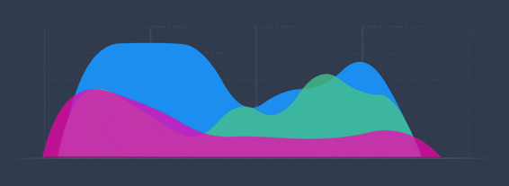

# About RTDIP

{width=100%}

## What is Real Time Data Ingestion Platform

Organizations need data for day-to-day operations and to support advanced Data Science, Statistical and Machine Learning capabilities such as Optimization, Surveillance, Forecasting, and Predictive Analytics. **Real Time Data** forms a major part of the total data utilized in these activities.

Real time data enables organizations to detect and respond to changes in their systems thus improving the efficiency of their operations. This data needs to be available in scalable and secure data platforms. 

**Real Time Data Ingestion Platform (RTDIP)** is the solution of choice leveraging **PaaS** (Platform as a Service) services along with some custom components to provide Data Ingestion, Data Transformation, and Data Sharing as a platform. RTDIP can interface with several data sources to ingest many different data types which include time series, alarms, video, photos and audio being provided from sources such as Historians, OPC Servers and Rest APIs, as well as data being sent from hardware such as IoT Sensors, Robots and Drones.
