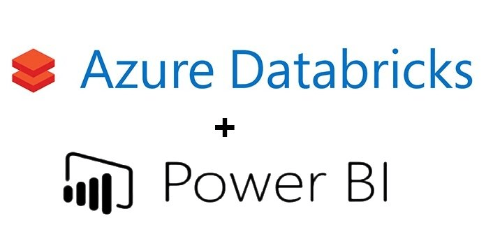
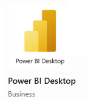
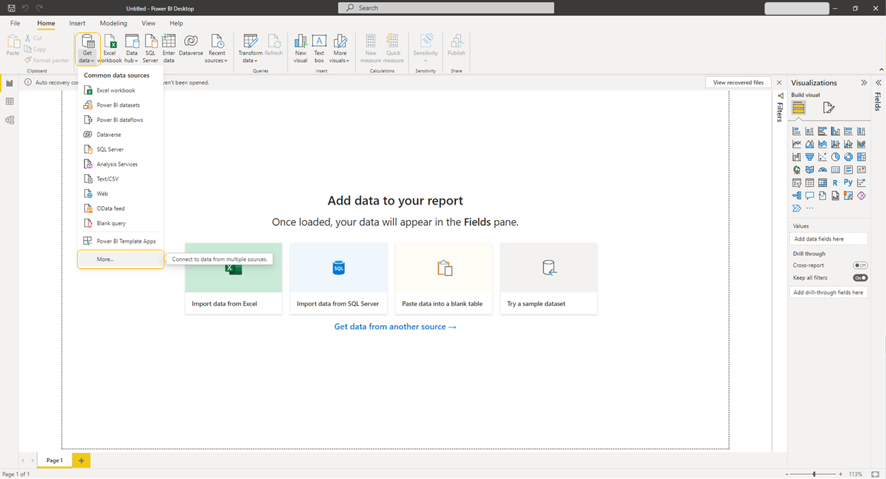
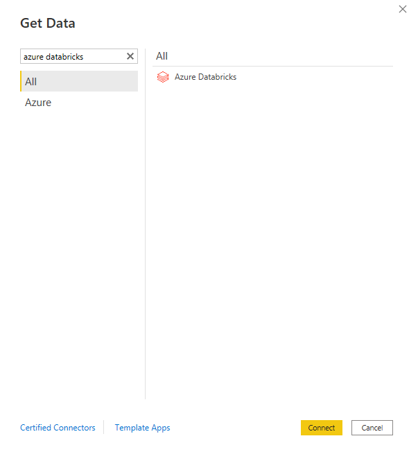
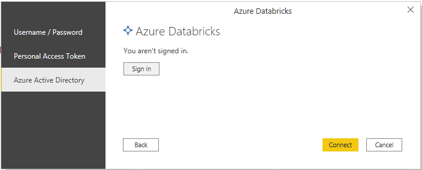

# Integration of Power BI with RTDIP

## Integration with Power BI

<!-- --8<-- [start:powerbi] -->

Microsoft Power BI is a business analytics service that provides interactive visualizations with self-service business intelligence capabilities
that enable end users to create reports and dashboards by themselves without having to depend on information technology staff or database administrators.

{width=50%}

When you use Azure Databricks as a data source with Power BI, you can bring the advantages of Azure Databricks performance and technology beyond data scientists and data engineers to all business users.

You can connect Power BI Desktop to your Azure Databricks clusters and Databricks SQL warehouses by using the built-in Azure Databricks connector. You can also publish Power BI reports to the Power BI service and enable users to access the underlying Azure Databricks data using single sign-on (SSO), passing along the same Azure Active Directory credentials they use to access the report.

For more information on how to connect Power BI with databricks, see [here](https://docs.microsoft.com/en-us/azure/databricks/integrations/bi/power-bi).

## Power BI Installation Instructions

1. Install **Power BI** Desktop application from **Microsoft Store** using your **Microsoft Account** to sign in.

1. Open **Power BI** desktop.

1. Click on **Home**, **Get data** and **More...**

1. Search for **Azure Databricks** and click **Connect**. 

1. Fill in the details and click **OK**.

1. Connect to the RTDIP data using your **Databricks SQL Warehouse** connection details including Hostname and HTTP Path. For **Data Connectivity mode**, select **DirectQuery**.

1. Click **Azure Active Directory**, **Sign In** and select **Connect**. In **Power Query Editor**, there are different tables for different data types.

1. Once connected to the Databricks SQL Warehouse, navigate to the Business Unit in the navigator bar on the left and select the asset tables for the data you wish to use in your report. There is functionality to select multiple tables if required. Click **Load** to get the queried data.

<!-- --8<-- [end:powerbi] -->