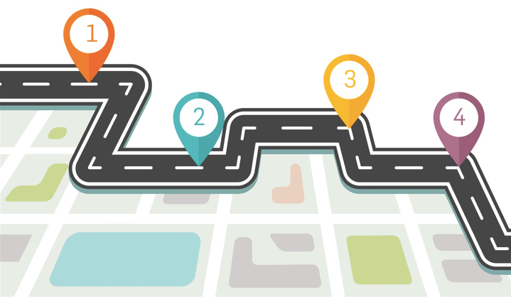
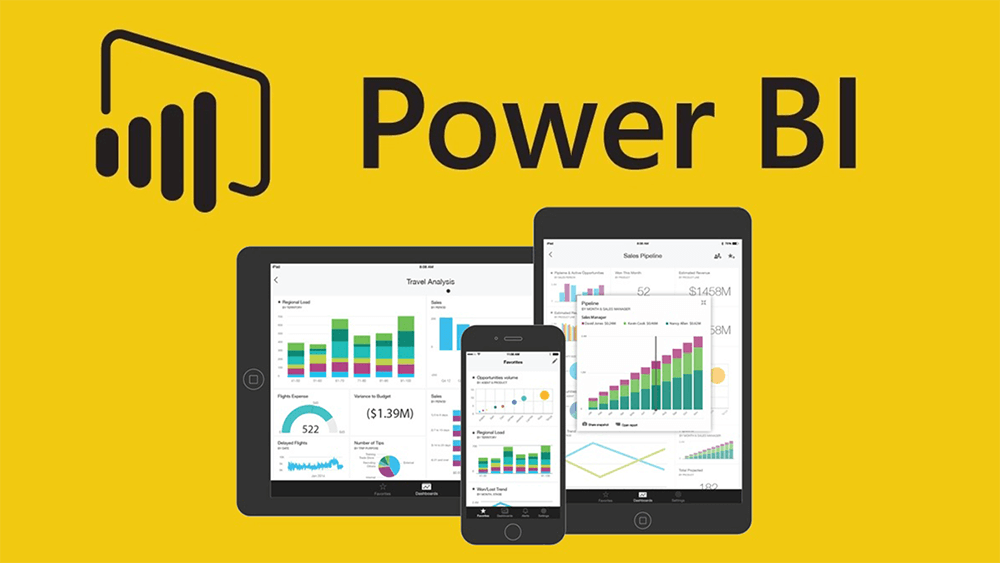
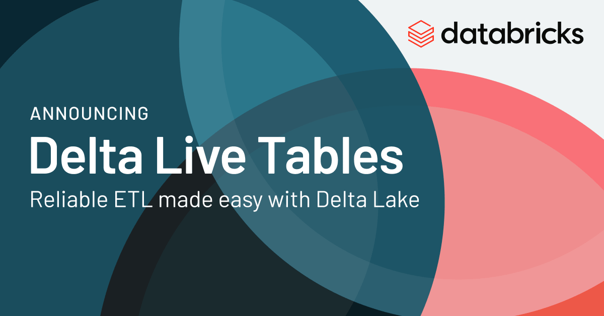
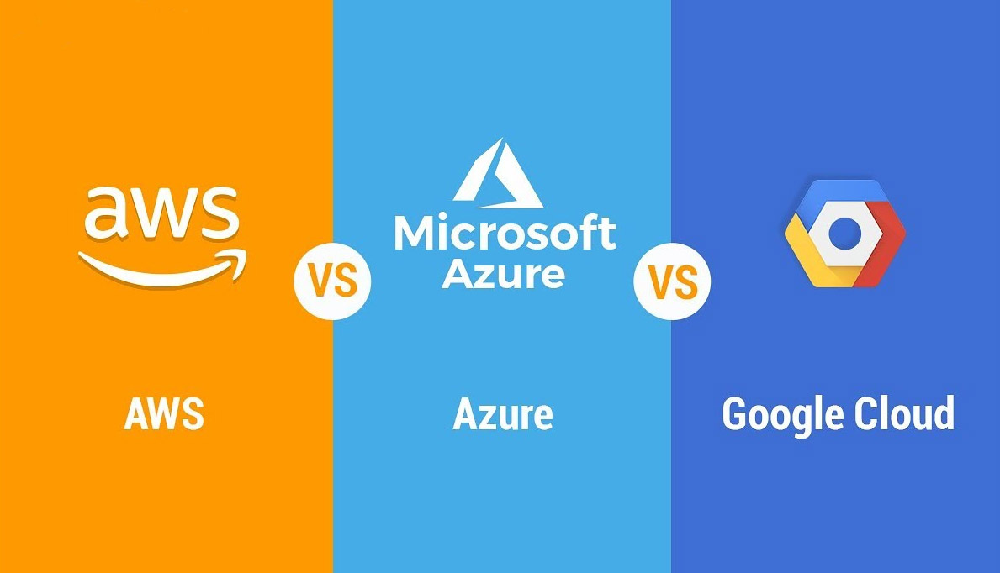
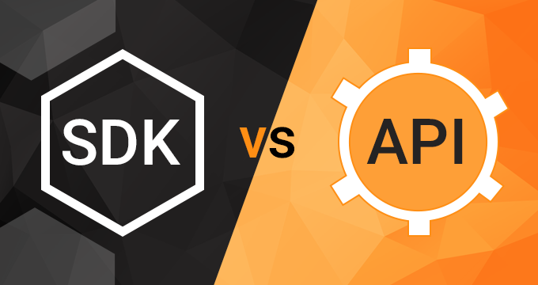
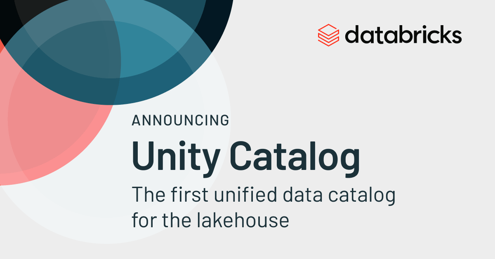
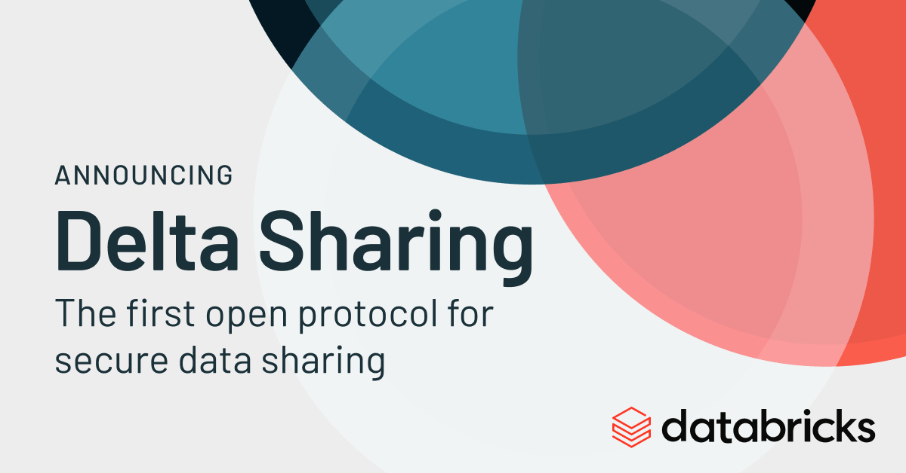

# RTDIP Development Roadmap in 2022

{: .image-center}

Defining a list of development items for RTDIP is always difficult because so much can change within  Digital Technologies in 12 months. However, as we head towards the end of the year of 2021, we have outlined themes of what RTDIP will look at in the Development and Innovation space in 2022.

We welcome and encourage projects, developers, users and applications to contribute to our roadmaps. Please reach out to the RTDIP Technical Steering Committee team if you have ideas or suggestions on what we could innovate on in this space. We will continue to evolve these development items all through 2022 so please come back to this article throughout the year to see any new items that may be brought into scope.

!!! note "Note"
    Development and Innovation items don't always make it to Production. 

## TL;DR

A brief summary of development and innovation items planned for 2022.

| Item | Description | Estimated Quarter for Delivery |
|------|-------------|--------------------------------|
| Power BI | Enable querying of RTDIP data via Power BI. While some work has started on this in 2021, this item explores rolling it out further and how users can combine RTDIP data with other data sources | Q1 2022 |
| Seeq Connector | Enable querying of RTDIP data via Seeq. Scope is limited to simply querying RTDIP data, we may look at what else is possible with the connector once the base capability has been achieved | Q1 2022 |
| Delta Live Tables | Leverage [Delta Live Tables](https://docs.microsoft.com/en-us/azure/databricks/data-engineering/delta-live-tables/) for ingestion of RTDIP data into Delta Format. Provides better processing, merging, data cleansing and monitoring capabilities to the RTDIP Delta Ingestion Pipelines | Q1-Q2 2022 |
| Multicloud | Build certain existing RTDIP Azure capabilities on AWS. Enables RTDIP in the clouds aligned with the business but also to ensure multicloud is cost effective and that products in the architecture work in Cloud Environments | Q1-Q3 2022 |
| SDK | An open source python SDK is developed to assist users with a simple python library for connecting, authenticating and querying RTDIP data | Q1-Q4 2022 |
| REST API | Wrap the python SDK in a REST API to allow non Python users to get similar functionality to the python SDK | Q1-Q4 2022 |
| Unity Catalog | Provides a multi-region Catalog of all data in RTDIP. Enables easier navigation and exploration of what datasets are available in RTDIP | Q3 2022 |
| Delta Sharing | Enables sharing of Delta data via a managed service that handles security, authentication and delivery of data. Particularly useful for sharing RTDIP data with third parties | Q4 2022 |

## Power BI

{: .image-center}

Power BI is a popular tool amongst RTDIP End Users for querying and plotting RTDIP data. The use of Delta and Databricks SQL Warehouses in the RTDIP Platform brings native Power BI integration using connectors already available in Power BI versions after May 2021.

The aim is to enable Power BI connectivity to RTDIP so that users can query their data by the end of Q1 2022.

## Seeq

{: .image-center}

Similar to Power BI, Seeq is a popular tool amongst real time users to query and manipulate RTDIP data. Seeq and RTDIP are currently working on a connector that allows Seeq to query RTDIP data via the same Databricks SQL Warehouse that Power BI will use for querying data by the end of Q1 2022.

## Delta Live Tables

{: .image-center}

For more information about the advantages of Delta Live Tables, please see this [link](https://docs.microsoft.com/en-us/azure/databricks/data-engineering/delta-live-tables/) and if you would like to see Bryce Bartmann, RTDIP team member, talking about Delta Live Tables at the Data & AI Summit 2021, please see the session [here](https://databricks.com/session_na21/make-reliable-etl-easy-on-delta-lake).

RTDIP has been converting it's data to the open source format [Delta](https://delta.io/) using standard PySpark structured streaming jobs. Whilst this has been working well for converting RTDIP data to Delta, Delta Live Tables from Databricks provides similar capabilities as standard spark code, but with additional benefits:

- Expectations: Allows developers to specify data cleansing rules on ingested data. This can assist to provide higher quality, more reliable data to users
- Data Flows: Visually describes the flow of the data through the data pipelines from source to target, including data schemas and record counts
- Maintenance: Delta Live Tables simplifies maintenance tasks required for Delta Tables by scheduling them automatically based on the deployment of the Delta Live Tables Job
- Monitoring: Delta Live Tables are easier to monitor as their graphical schematics help non-technical people to understand the status of the ingestion pipelines

The RTDIP Team has actively worked with Databricks to build Delta Live Tables. Whilst the product is well understood, certain features like merging data needed to be made available before RTDIP could fully migrate existing spark jobs to Delta Live Tables. Databricks intend to provide the Merge function in late Q4 2021 which will then trigger this piece of work with a target of having a decision point to move to production in Q1 2022.

## Multicloud

{: .image-center}

As clouds mature, one of the most asked questions is how customers can leverage more than one cloud to provide a better and more economical solution to their customers. Even though this is a fairly new area to explore, there are a number of cloud agnostic technologies that are trying to help customers take advantage of and manage environments in more than one cloud.

Multicloud design can be complex and requires significant analysis of existing technologies capabilities and how they translate into benefits for RTDIP customers. Databricks will be one good example of exploring their new multicloud environment management tool and how this could benefit businesses in the long run. We expect there to be more technologies that come out with multicloud capabilities throughout 2022 and we will continue to explore, test and understand how RTDIP can leverage these throughout 2022 and beyond.

## SDK and REST API

{: .image-center}

A common theme we are seeing amongst applications and users of RTDIP data is a simple way to authenticate, query and manipulate RTDIP data. In an effort to also build a stronger developer community around RTDIP, we will be building a python SDK that python users can use in their code for performing common functions with RTDIP Data:

- Authenticating with RTDIP
- Connecting to RTDIP data
- Querying RTDIP raw data
- Performing sampling on raw data
- Performing interpolation on sampled data

We plan to deliver the first version of the python SDK early in 2022 and welcome all python developers to contribute to the repository. 

For non python users, we plan to wrap the SDK in a REST API. This facilitates a language agnostic way of benefitting from all the development of the python SDK. These REST APIs will be rolled out in line with functionality built with the python SDK.

## Unity Catalog

{: .image-center}

Cataloging data is a common activity when building data lakes that contain data from multiple sources and from multiple geographic regions. RTDIP will explore and deploy a catalog of all data sources currently being ingested into the platform.

## Delta Sharing

{: .image-center}

One of the most common requests the RTDIP team receive is how to share RTDIP data with third parties. Delta Sharing is an open source capability that allows sharing of Delta data via a managed service that provides authentication, connection management and supply of Delta data to third parties. 

We aim to see what more we can do in this space to make sharing of data simpler from an architecture perspective while still meeting all the security requirements around sharing of data with third parties.
