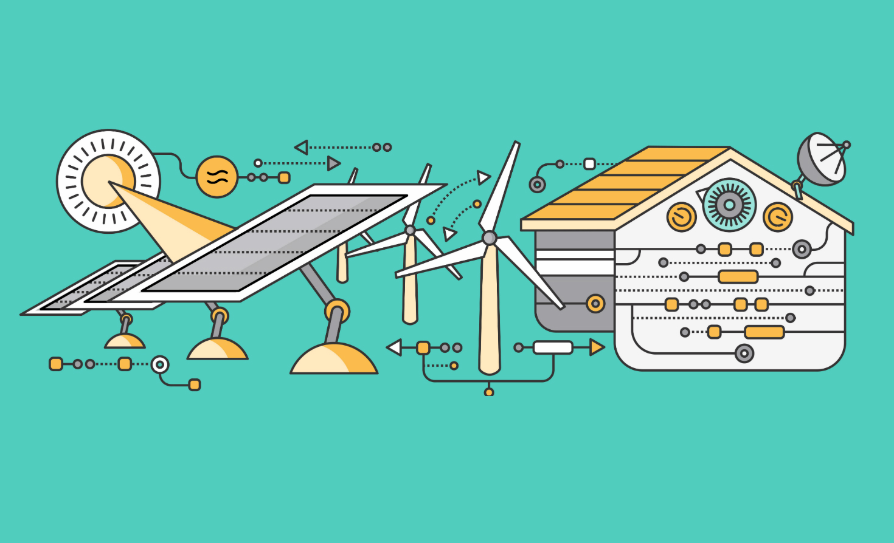

# RTDIP Development Roadmap in 2023

{: .center}

Shell’s internally developed Shell Sensor Intelligence Platform was open sourced to LF Energy in 2022 and rebranded to Real Time Data Ingestion Platform. This was a major milestone for that project and has opened a number of strategic doors and expanded how the development roadmap is determined when considering it in an open source context. Below is the roadmap for 2023

We welcome and encourage projects, developers, users and applications to contribute to our roadmaps. Please reach out to the RTDIP Technical Steering Committee team if you have ideas or suggestions on what we could innovate on in this space. We will continue to evolve these development items all through 2022 so please come back to this article throughout the year to see any new items that may be brought into scope.

## TL;DR

| Item | Description | Estimated Quarter for Delivery |
|------|-------------|--------------------------------|
| IEC CIM | RTDIP will target the IEC CIM data model and focus specifically on modelling data related to scada/process time series and sensor metadata | Q1 2023 |
| Ingestion Framework | Develop a Data Ingestion framework, incorporated into the RTDIP SDK that supports building, testing and deploying streaming data pipelines into an RTDIP environment. The goal of this framework is to eventually facilitate low-code/no-code setup of streaming data pipelines that can be easily deployed by RTDIP users. In 2023, the first iteration of the framework will be designed and developed | Q1-Q2 2023 |
| Meter Data | Design and build ingestion pipelines for meter data that meets the IEC CIM and Data Ingestion Framework items above | Q2-Q4 2023 |
| LF Energy Integration | Increase integration of RTDIP with other LF Energy components. RTDIP will reach out to LF Energy projects to understand which data and integration opportunities exist and support building the necessary components to support these integrations | Q1-Q4 2023 |
| Microgrid Support | Deployment of RTDIP and related LF Energy components to a pilot microgrid site  | Q1-Q4 2023 |
| Multicloud | Build certain existing RTDIP Azure capabilities on AWS. Enables RTDIP in the clouds aligned with the business but also to ensure multicloud is cost effective and that products in the architecture work in Cloud Environments | Q1-Q3 2023 |
| Adoption | Adapt RTDIP to cater for a wider audience, particularly to increase RTDIP adoption in the energy sector. A simpler deployment process, facilitation of more environments RTDIP can setup in and catering for more orchestration engines are all initiatives to increase adoption in 2023 | Q1-Q4 2023 |

## IEC CIM

{: .image-center}

RTDIP will define IEC CIM compliant data models that will be built in the RTDIP SDK for time series data and metering data. This will ensure that RTDIP can support systems that require data modelled to the IEC CIM standard. The data models will be defined and available within the RTDIP SDK so that it can be used in the ingestion and query layers of the RTDIP SDK.

## Ingestion Framework

{: .image-center}

An ingestion framework will be incorporated into the RTDIP SDK that will facilitate the following:
- Simple reuse of components
- Standardisation of development of ingestion source, transformation and destination components
- A common deployment pattern that supports the most popular spark environment setups
- Targeting of popular orchestration engines and targeting Databricks Worflows and Airflow. Dagster/Flyte to be considered.

The ingestion framework will be designed and developed in Q1-Q3 2023 and will be used to build the ingestion pipelines for meter data in Q2-Q4 2023.

## Meter Data

{: .image-center}

RTDIP will be extended to incorporate meter data as part of the platform. The ingestion framework above will be used to build ingestion pipelines for meter data. The pipelines will be designed to ingest meter data from a variety of meter data sources and will be designed to support the IEC CIM data model.

## LF Energy Integration

{: .image-center}

Increase integration of RTDIP with other LF Energy components. Data is at the centre of every component in an energy system and a data platform can play a major role in supporting integration across different components. RTDIP will reach out to LF Energy projects to understand which data and integration opportunities exist and support building the necessary components to support this integration. The scope of this will be more clearly defined after connecting with the relevant projects of LF Energy to define opportunities for integration.

## Microgrid Support

{: .image-center}

Deployment of RTDIP and related LF Energy components to a Shell pilot microgrid site. This exercise will help to identify how RTDIP supports an energy system better and demonstrate the integration of RTDIP with other LF Energy components in a real world environment.

## Adoption

Adapt RTDIP to cater for a wider audience, particularly to increase RTDIP adoption in the energy sector. To do this, the roadmap for 2023 will focus on:

- Making it simpler for deploying and incorporating RTDIP into existing technology stacks
- Provide options for deploying RTDIP ingestion jobs in different Spark Environments. For 2023, this will be Databricks(Jobs with stretch target of DLT) and self-managed Spark Clusters setup using Open Source Spark
- Support deployment of RTDIP data pipelines to different workflow managers. For 2023, this will include Airflow and Databricks Workflows, with a stretch target of including Dagster
- Support more clouds. For 2023, the target is AWS.

## Multicloud

{: .image-center}

The target for 2023 is to enable RTDIP components to run in AWS. This includes:

- RTDIP API support on AWS Lambda
- Ingestion support on AWS Databricks
- BI support on AWS Databricks SQL