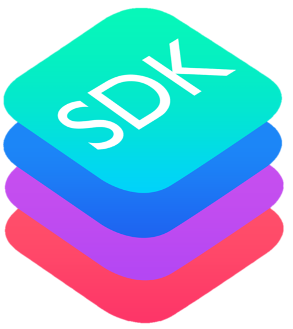

{width=40%}

# What is the RTDIP SDK?

​​**Real Time Data Ingestion Platform (RTDIP) SDK** is a python software development kit built to provide users, data scientists and developers with the ability to interact with components of the Real Time Data Ingestion Platform, including:

- Building, Executing and Deploying Ingestion Pipelines
- Execution of queries on RTDIP data
- Authentication to securely interact with environments and data

## Installation

To get started with the RTDIP SDK, follow these [installation instructions.](../getting-started/installation.md)

## Pipelines

Find out more about RTDIP Ingestion Pipeline Framework and the components [here.](./pipelines/framework.md)

## Queries

Find out more about querying RTDIP data using built in time series functions [here.](./queries/functions.md)

## Authentication

Find out more about authentication to securely interact with evironments and data [here.](./authentication/azure.md)