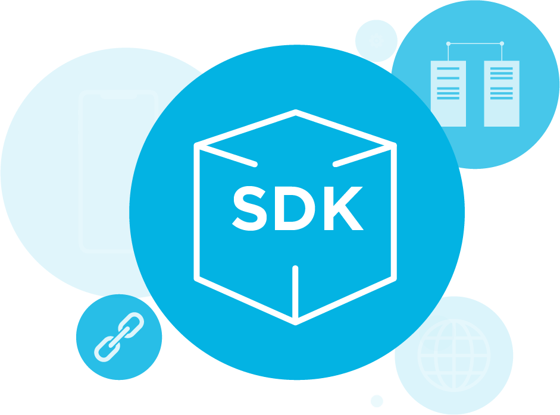

{width=50%}

# What is RTDIP SDK?

​​**Real Time Data Ingestion Platform (RTDIP) SDK** is a software development kit built to easily access some of RTDIP's transformation functions.

The RTDIP SDK will give the end user the power to use some of the convenience methods for frequency conversions and resampling of Pi data all through a self-service platform. RTDIP is offering a flexible product with the ability to authenticate and connect to Databricks SQL Warehouses given the end users preferences. RTDIP have taken the initiative to cut out the middle man and instead wrap these commonly requested methods in a simple python module so that you can instead focus on the data. 

See [RTDIP SDK Usage](rtdip-sdk-usage.md) for more information on how to use the SDK.

## Authenticators

The RTDIP SDK includes several authentication methods to cater to the preference of the user. See below:

* [Default Authentication](code-reference/query/authenticate.md) - For authenticating users with Azure AD using the [azure-identity](https://docs.microsoft.com/en-us/python/api/azure-identity/azure.identity.defaultazurecredential?view=azure-python) package. Note the order that Default Authentication uses to sign in a user and how it does it in this [documentation](https://azuresdkdocs.blob.core.windows.net/$web/python/azure-identity/1.10.0b1/index.html). From experience, the Visual Studio Code login is the easiest to setup, but the azure cli option is the most reliable option. This [page](https://github.com/Azure/azure-sdk-for-python/blob/main/sdk/identity/azure-identity/TROUBLESHOOTING.md#troubleshooting-default-azure-credential-authentication-issues) is useful for troubleshooting issues with this option to authenticate.

!!! note "Visual Studio Code"
    As per the guidance in the documentation - **To authenticate in Visual Studio Code, ensure version 0.9.11 or earlier of the Azure Account extension is installed. To track progress toward supporting newer extension versions, see [this GitHub issue](https://github.com/Azure/azure-sdk-for-net/issues/27263). Once installed, open the Command Palette and run the Azure: Sign In command**.

* [Certificate Authentication](code-reference/query/authenticate.md) - Service Principal authentication using a certificate

* [Client Secret Authentication](code-reference/query/authenticate.md) - Service Principal authentication using a client id and client secret

!!! note "Note"
    </b>RTDIP are continuously adding more to this list so check back regularly! 

## SQL Warehouses

The RTDIP SDK uses Databricks SQL Warehouses to provide access to RTDIP data. See below for different endpoint options depending on the region required:

* [SQL Warehouses](sqlwarehouses/sql-warehouses.md)

## Connectors

Once the user is authenticated, they can connect to Databricks SQL warehouses using one of the following methods:

* [Databricks SQL Connector](code-reference/query/db-sql-connector.md) 

* [PYODBC SQL Connector](code-reference/query/pyodbc-sql-connector.md)

* [TURBODBC SQL Connector](code-reference/query/turbodbc-sql-connector.md) 

## Functions

Finally, once the user is authenticated and connected to Databricks SQL Warehouses they have access the following functions:

* [Resample](code-reference/query/resample.md) 

* [Interpolate](code-reference/query/interpolate.md)

* [Raw](code-reference/query/raw.md)

* [Time Weighted Averages](code-reference/query/time-weighted-average.md)

* [Metadata](code-reference/query/metadata.md)

!!! note "Note"
    </b>RTDIP are continuously adding more to this list so check back regularly! 
