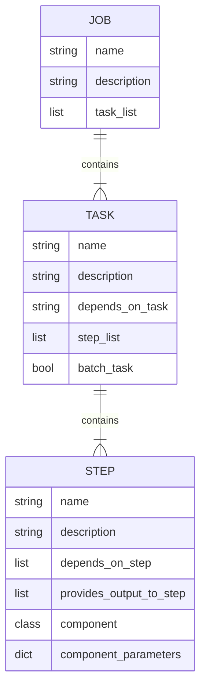

# RTDIP Ingestion Pipeline Framework

RTDIP has been built to simplify ingesting and querying time series data. The RTDIP Ingestion Pipeline Framework creates streaming and batch ingestion pipelines according to requirements of the source of the data and needs of the data consumer. RTDIP Pipelines focuses on the ingestion of data into the platform.

## Prerequisites

Ensure that you have followed the installation instructions as specified in the [Getting Started](../../getting-started/installation.md) section and follow the steps which highlight the installation requirements for Pipelines. In particular:

1. [RTDIP SDK Installation](../../getting-started/installation.md#installing-the-rtdip-sdk)
1. [Java](../../getting-started/installation.md#java) - If your pipeline steps utilize pyspark then Java must be installed.

!!! note "RTDIP SDK installation"
    Ensure you have installed the RTDIP SDK, as a minimum, as follows:
    ```
    pip install "rtdip-sdk[pipelines]"
    ```

    For all installation options please see the RTDIP SDK installation [instructions.](../../getting-started/installation.md#installing-the-rtdip-sdk)

## Overview

The goal of the RTDIP Ingestion Pipeline framework is to:

1. Support python and pyspark to build pipeline components
1. Enable execution of sources, transformers, destinations and utilities components in a framework that can execute them in a defined order
1. Create modular components that can be leveraged as a step in a pipeline task using Object Oriented Programming techniques included Interfaces and Implementations per component type
1. Deploy pipelines to popular orchestration engines
1. Ensure pipelines can be constructed and executed using the RTDIP SDK and rest APIs

## Jobs

The RTDIP Data Ingestion Pipeline Framework follow sthe typical convention of a job that users will be familiar with if they have used orchestration engines such as Apache Airflow or Databricks Workflows.

A pipline job consists of the following components:



As per the above, a pipeline job consists of a list of tasks. Each task consists of a list of steps. Each step consists of a component and a set of parameters that are passed to the component. Dependency Injection will ensure that each component is instantiated with the correct parameters. 

More Information about Pipeline Jobs can be found [here.](jobs.md)

## Runtime Environments

|Python|Apache Spark|Databricks|Delta Live Tables|
|---------------------------|----------------------|--------------------------------------------------|-------|
|{: .image-center}|{: .image-center}|{: .image-center}|{: .image-center}

!!! note "Note"
    </b>RTDIP are continuously adding more to this list. For detailed information on timelines, read this [blog post](../../blog/posts/rtdip_ingestion_pipelines.md) and check back on this page regularly.<br />

Pipelines can run in multiple environment types. These include:

- Python: Components written in python and executed on a python runtime
- Pyspark: Components written in pyspark and executed on an open source Apache Spark runtime
- Databricks: Components written in pyspark and executed on a Databricks runtime
- Delta Live Tables: Components written in pyspark and executed on a Databricks Delta Live Tables runtime

Runtimes will take precedence depending on the list of components in a pipeline task.

- Pipelines with at least one Databricks or DLT component will be executed in a Databricks environment
- Pipelines with at least one Pyspark component will be executed in a Pyspark environment
- Pipelines with only Python components will be executed in a Python environment

## Conclusion

Find out more about the components that can be used by the RTDIP Ingestion Pipeline Framework [here.](components.md)