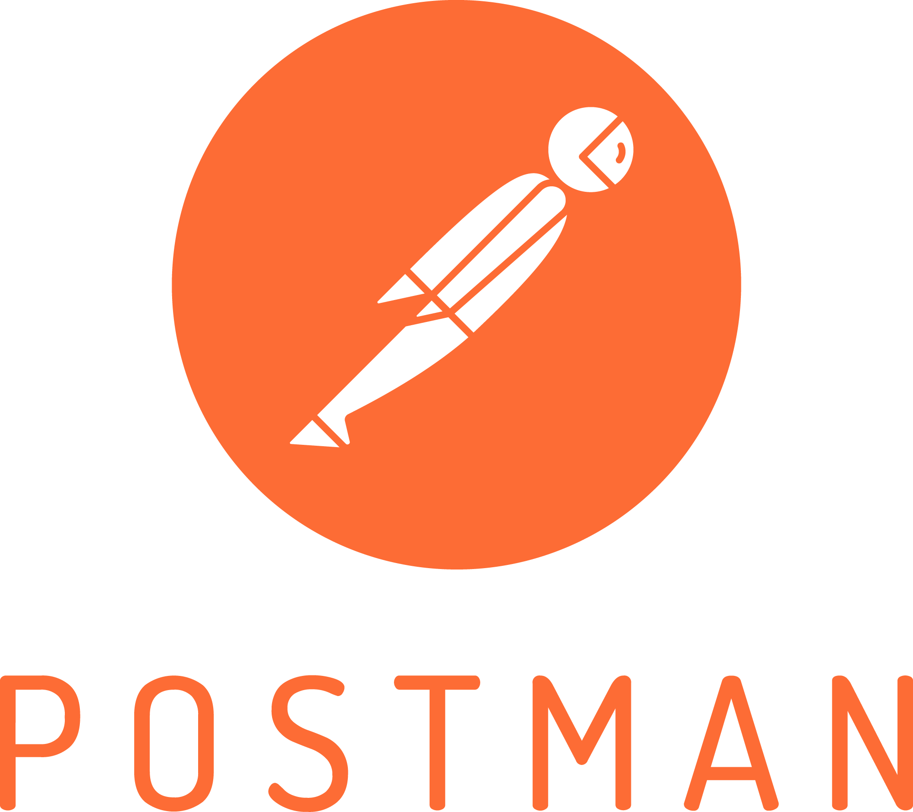

# What is Postman?

 {width=40%} 

Postman is an API platform for building and using APIs. Some features of Postman include:

* API repository -  Easily store, catalog and collaborate your APIs in a central platform.
* Tools - Includes a set of tools that helps accelerate the API lifecyle from design, testing, documenting and sharing of APIs
* Workspaces - Helps organise your APIs and collaborate with teams across your organisation. 

Developers widely use Postman to simplify the process of testing APIs by providing a user-friendly interface for making requests, viewing responses and debugging issues. 

To learn more about Postman, see [Postman Documentation](https://learning.postman.com/docs/introduction/overview/#home).

  
[← Previous](./swagger.md){ .curved-button }
[Next →](./exercise.md){ .curved-button }

## Course Progress
-   [X] Introduction
-   [X] SDK
-   [X] Power BI
-   [ ] APIs
    *   [X] Overview
    *   [X] Authentication
    *   [X] Swagger
    *   [X] Postman
    *   [ ] Exercise
-   [ ] Excel Connector