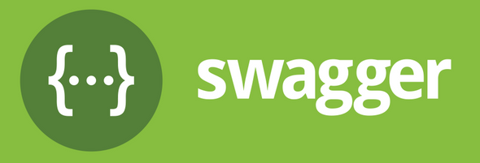

# What is Swagger?

Swagger is a set of open-source tools built around the OpenAPI Specification that can help you design, build, document and consume REST APIs. OpenAPI Specification is an API description format for REST APIs. An OpenAPI file will typically allow you to describe your entire API, including:

* Available operations your API supports
* Your API parameters and what it returns
* Authentication methods
* Contact information, license, terms of use and other information

Some of the featured Swagger tools are:

* [Swagger Editor](https://editor.swagger.io/?_gl=1*1l44voh*_gcl_au*MTk3MTI5Nzc3OS4xNzIzMTI1MjU2&_ga=2.153580796.559233685.1723125255-2135126424.1723125254) - a browser-based editor where you can write OpenAPI definitions.
* [Swagger UI](https://github.com/swagger-api/swagger-ui) - renders OpenAPI definitions as interactive document.
* [Swagger Codegen](https://github.com/swagger-api/swagger-codegen) - generates sever stubs and client libraries from OpenAPI definitions.

To find out more information about Swagger, see [Swagger Documentation](https://swagger.io/docs/).

   

# RTDIP REST API Endpoints

RTDIP REST API documentation is available in a number of formats, as described below. 

 {width=50%} 

--8<-- "api/rest_apis.md:openapi"

 {width=50%} 

--8<-- "api/rest_apis.md:swagger"

 {width=50%} 

--8<-- "api/rest_apis.md:redoc"

  
[← Previous](./authentication.md){ .curved-button }
[Next →](./postman.md){ .curved-button }

## Course Progress
-   [X] Introduction
-   [X] SDK
-   [X] Power BI
-   [ ] APIs
    *   [X] Overview
    *   [X] Authentication
    *   [X] Swagger
    *   [ ] Postman
    *   [ ] Exercise
-   [ ] Excel Connector