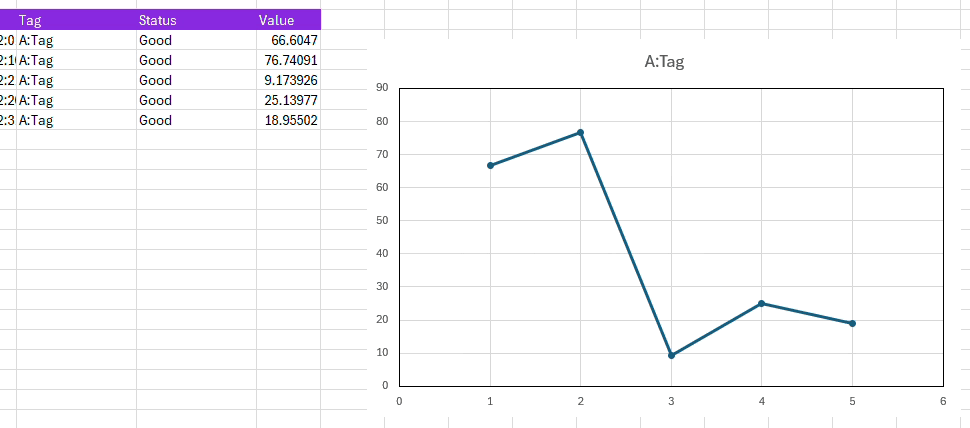

# Exercise: Creating a Simple Dashboard with Live Data

>
All the functions (except Metadata) are capable of refreshing at a set interval with the `refreshIntervalSeconds` parameter.
>

For our final exercise, we will put everything together and create a simple dashboard.

**Here are the steps:**

1. Create a query for a tag that has live updating data and put the end date as the future (or now via `*`).
2. Create a scatter or line chart with your data.
3. Either with the taskpane `Advanced Parameters` or by editing your formula, set `refreshIntervalSeconds` to a number (min value `10`).
4. Watch your chart update with live data.

 {width=100%} 

>
Note: Currently, if you require excel to recognise dates on plots you will need to do `=VALUE(your_date_cell)`.
>

## Additional Task

Look at the dashboard and you will see which functions are streaming and which are not - it is always a good idea to check this in case you have any stray functions running.

That's the end of this lesson - if you have any feedback about the Excel Add-in we'd love to hear it!

  
[← Previous](./functions.md){ .curved-button }

>
Congratulations on finishing RTDIP Essentials!
>

## Course Progress
-   [X] Overview
-   [X] SDK
-   [X] Power BI
-   [X] APIs
-   [X] Excel Connector
    *   [X] Overview
    *   [X] Getting Started
    *   [X] Exercise: Exploring the Taskpane
    *   [X] Exercise: Exploring the Functions
    *   [X] Exercise: Creating a Simple Dashboard with Live Data