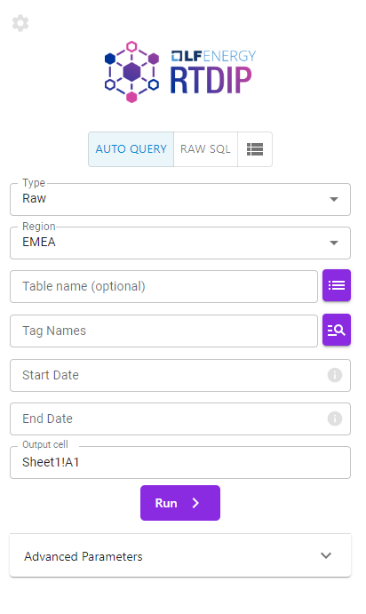

# Getting Started

>
> Note: Although the images reference windows, all the functionality will work on mac.
>

To get started, open up Microsoft Excel and go to the `Home` tab. On the right you should see the RTDIP Taskpane like this (if not, you may need to click `Add-ins`):

 {width=200px} 

Once opened, the set-up screen will show and will ask for your API URL. This will be the same URL as in the previous lessons in the format `https://YOUR_ORGANISATION_DOMAIN/api/v1`

After this, you should see our friendly taskpane (you are now completely set-up and ready to make some queries!):

 {width=40%} 

Let's move onto the next section:

  
[← Previous](./overview.md){ .curved-button }
[Next →](./taskpane.md){ .curved-button }

## Course Progress
-   [X] Overview
-   [X] SDK
-   [X] Power BI
-   [X] APIs
-   [ ] Excel Connector
    *   [X] Overview
    *   [X] Getting Started
    *   [ ] Exercise: Exploring the Taskpane
    *   [ ] Exercise: Exploring the Functions
    *   [ ] Exercise: Creating a Simple Dashboard with Live Data