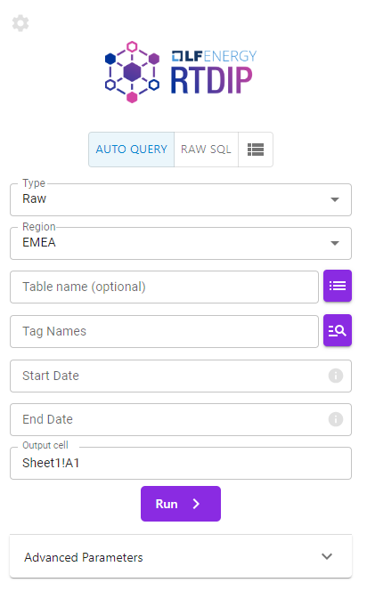

# RTDIP Excel Add-in

>
> Note: This course assumes you already have the RTDIP Add-in installed by your organisation.
>

 {width=40%} 

The RTDIP Excel Add-in is one of the simplest ways to get timeseries data from databricks to Microsoft Excel.

Behind the scenes the add-in sends requests to the RTDIP API, but as you'll see in this lesson, the entryway is simplified including authentication via SSO, date parsing and more!

For now, here's a sneak peak of the task pane:

 {width=40%} 

>
> If your course is facillitated, your facilitator will have a completed Excel workbook specific to your organisation
>

  
[← Previous](../api/exercise.md){ .curved-button }
[Next →](./getting-started.md){ .curved-button }

## Course Progress
-   [X] Overview
-   [X] SDK
-   [X] Power BI
-   [X] APIs
-   [ ] Excel Connector
    *   [X] Overview
    *   [ ] Getting started fetching your first data
    *   [ ] Exercise: Exploring the Taskpane
    *   [ ] Exercise: Exploring the Functions
    *   [ ] Exercise: Creating a Simple Dashboard with Live Data
