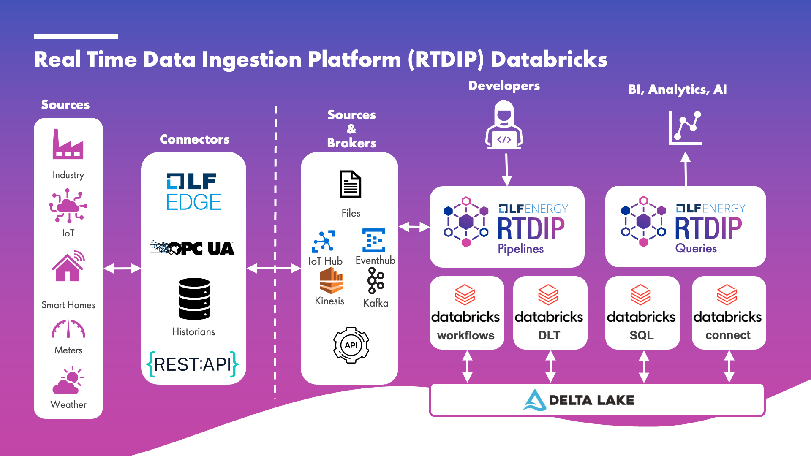

# Architecture

## Databricks

RTDIP integrates with Databricks and supports executing time series queries or ingesting data. Queries are executed using either Databricks SQL Warehouses or Spark Connect. Data Ingestion can be run and orchestrated using Databricks Workflows or Delta Live Tables.

For further information about Databricks, please refer to:

- [Databricks SQL](https://www.databricks.com/product/databricks-sql)
- [Databricks Workflows](https://docs.databricks.com/en/workflows/index.html)
- [Delta Live Tables](https://www.databricks.com/product/delta-live-tables)

  
[← Previous](./pipelines.md){ .curved-button }
[Next →](../../sdk/getting-started/prerequisites.md){ .curved-button }

## Course Progress

-   [ ] Introduction
    +  [X] Overview
    +  [X] Prerequisites
    *  [ ] Architecture
        +   [X] Queries
        +   [X] Pipelines
        +   [X] Databricks
    *  [ ] Getting Started
-   [ ] SDK
-   [ ] Power BI
-   [ ] APIs
-   [ ] Excel Connector