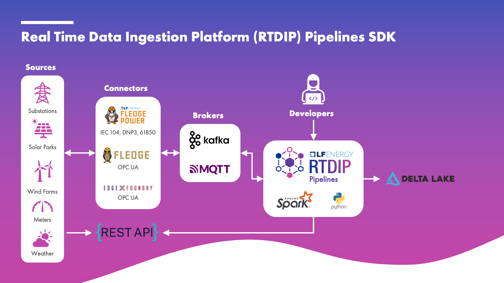

# Architecture

## Pipelines

Not in scope for this particular course but it is worth mentioning that RTDIP also provides the ability to create and manage time series ingestion pipelines. Pipelines are a series of steps that are executed in sequence to process time series data. Pipeline components consist of data sources, data sinks, and processing steps.

  
[← Previous](./queries.md){ .curved-button }
[Next →](./databricks.md){ .curved-button }

## Course Progress

-   [ ] Introduction
    +   [X] Overview
    +   [X] Prerequisites
    *   [ ] Architecture
        +   [X] Queries
        +   [X] Pipelines
        +   [ ] Databricks
    *  [ ] Getting Started
-   [ ] SDK
-   [ ] Power BI
-   [ ] APIs
-   [ ] Excel Connector