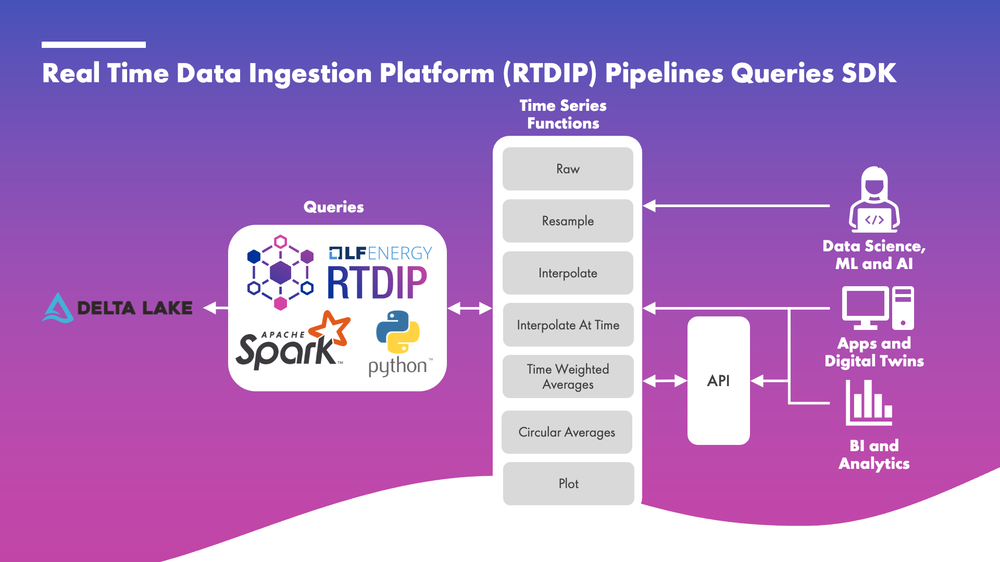

# Architecture

## Queries

RTDIP provides the ability to execute time series queries on the data stored in the RTDIP platform. The queries can be executed using the RTDIP SDK or APIs, queries such as raw, resample, interpolation, interpolate at time, time-weighted average, circular averages, circular standard deviation, latest, plot, summary, and metadata.

The RTDIP Essentials course will focus on RTDIP queries in the sections that follow.

  
[← Previous](../introduction/prerequisites.md){ .curved-button }
[Next →](./pipelines.md){ .curved-button }

## Course Progress

-   [ ] Introduction
    +  [X] Overview
    +  [X] Prerequisites
    *  [ ] Architecture
        +   [X] Queries
        +   [ ] Pipelines
        +   [ ] Databricks
    *  [ ] Getting Started
-   [ ] SDK
-   [ ] Power BI
-   [ ] APIs
-   [ ] Excel Connector